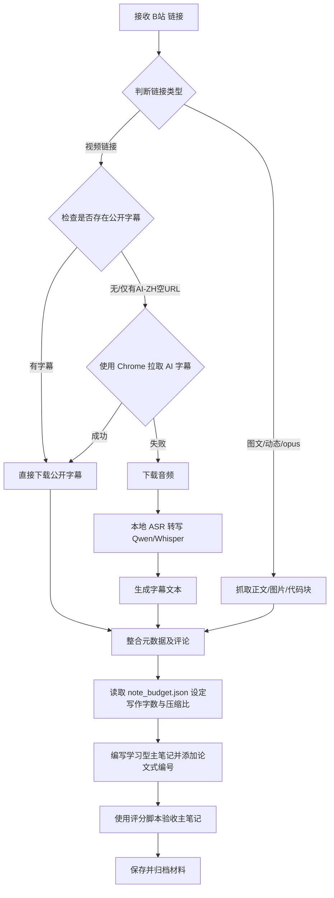

<p align="center">
  
</p>

<p align="center">
  
  
  
</p>

# Bili Note

Bili Note 是一个面向知识库的 B 站视频与图文笔记工具：完整归档字幕、图文正文、图片与评论，按内容信息量和质量动态控制笔记长度，把 B 站内容整理成可学习、可检索、可追问的 Markdown 笔记。

---

## 🛠️ 第一阶段：环境自检与首次初始化引导

在使用 Bili Note 提取视频或图文前，AI Agent 必须首先验证运行环境，确保相关依赖已经就绪。

### 1. 运行依赖与自检命令

请在终端中运行以下自检命令以检查 Bili Note 的运行环境：

```powershell
python scripts/check_environment.py
```

如果需要让其他脚本以 JSON 格式读取环境检查结果，可以添加 `--json` 参数：

```powershell
python scripts/check_environment.py --json
```

自检输出将表明以下能力状态：
- `public_subtitles_comments_archive=OK`：基本字幕、图文、评论和归档功能可用（使用 Python 标准库，无特殊外部依赖）。
- `browser_ai_subtitles=OK`：网页 AI 字幕拉取状态就绪。
- `audio_asr_fallback=OK`：音频语音识别转写兜底状态就绪。

### 2. 缺失依赖的自愈与安装

根据运行环境自检的结果，如果缺失相关增强依赖，请按照以下步骤执行修复或安装：

| 依赖分类 | 对应功能 | 缺失影响 | 修复与安装方法 |
| :--- | :--- | :--- | :--- |
| **基础运行** | 抓取公开元数据、视频字幕、图文正文及评论 | 无法启动工具 | 确保系统中安装了 **Python 3.10+** 并将相关路径配置到系统环境变量中。 |
| **多媒体解码** | 语音转写前音频下载及格式处理 | 无法进行本地 ASR 音频转写 | 确保系统安装了 **ffmpeg**，并将其 `bin` 路径添加到系统 PATH 环境变量中。 |
| **中文语音转写** | 字幕缺失时作为中文字幕兜底生成工具 | 无法对无字幕中文视频进行语音转写 | 运行初始化环境脚本：<br>`python scripts/setup_qwen_asr_env.py`<br>该脚本将在共享本地缓存目录 `%USERPROFILE%\.cache\rimagination-notes\qwen3-asr-venv` 下创建 Qwen3-ASR 专属虚拟环境。 |
| **外语语音转写** | 外语视频语音转写 | 无法对外语视频进行语音转写 | 安装 `openai-whisper` 或 `faster-whisper` 等库，该工具在检测到外语视频时会自动调用。 |
| **网页 AI 字幕** | 拉取只有 `ai-zh` 且 `subtitle_url` 为空时的字幕 | 无法获取此类型的 AI 字幕 | 确保系统安装了 **Chrome 浏览器**，且处于登录 B 站账号的状态。使用 `web-access` 打开对应的播放页面。 |

> [!NOTE]
> Bili Note 与 DyNote 会共享位于 `%USERPROFILE%\.cache\rimagination-notes` 的本地缓存与模型文件。只要其中任意一个工具已完成 Qwen3-ASR 环境的配置，另一个工具即可直接复用，无需重复安装。

### 3. 首次使用凭证与配置

Bili Note 在拉取网页 AI 字幕时：
- 只会使用 Chrome 浏览器以及通过 `web-access` 代理接口拉取，**不读取、不导出、也不保存**用户的 Cookie、localStorage 或登录 Token。
- **无需手动输入凭证**：请确保本地 Chrome 浏览器处于已登录 B 站的状态即可，无任何本地配置凭证文件产生。
- 如果没有可用的 Chrome 登录态，Bili Note 会自动跳过网页 AI 字幕流程，改用公开字幕、音频转写等方式。

---

## 🚀 第二阶段：核心执行工作流

一旦环境自检通过，即可开展核心的内容提取、提炼和归档工作流。

### 1. 核心流程与功能优先级

Bili Note 处理视频和图文的逻辑如下：



- **视频处理**：
  1. 优先使用普通接口下载公开字幕（`--download-subtitles`）。
  2. 若接口提示有 `ai-zh` 字幕但 `subtitle_url` 为空，自动切换网页 AI 字幕路线（需要 `web-access` 配合 Chrome 浏览器）。
  3. 若以上均不可得，则下载音频进行 ASR 本地转写。
- **图文处理**：提取图文正文、图片、代码块，并构建对应证据索引。
- **评论区提炼**：传入 `--comments` 后会提取并过滤无意义讨论，只保留纠错、案例补充、替代方案和争议点。
- **写前定标**：编写笔记前必须先读取 `metadata/note_budget.json` 的推荐字数区间、压缩比和画面依赖提示，按照目标写笔记。
- **论文式引用**：在笔记中采用 `[1][2]` 的脚注编号对应归档材料，避免正文堆砌长证据。

### 2. 命令行使用手册

主入口文件为 `scripts/run_bili_note.py`，它会自动判断并分发视频或图文处理逻辑：

```powershell
python scripts/run_bili_note.py "<视频或图文URL>" --work-dir "<工作路径>" --archive-dir "<归档路径>" [其它可选参数]
```

#### 常用命令示例：

* **一键提取视频内容及评论区有用内容：**
  ```powershell
  python scripts/run_bili_note.py "https://www.bilibili.com/video/BV1xx411c7xx/" `
    --work-dir "./tmp_bili_extract" `
    --archive-dir "D:/knowledge/B站归档/BV1xx_视频标题" `
    --comments
  ```

* **提取图文/动态/opus 长文：**
  ```powershell
  python scripts/run_bili_note.py "https://www.bilibili.com/opus/1194341967364882439" `
    --work-dir "./tmp_bili_opus" `
    --archive-dir "D:/knowledge/B站归档/O1194341967364882439_图文标题" `
    --comments
  ```

* **图文提取时不下载图片文件（仅保留链接）：**
  ```powershell
  python scripts/run_bili_note.py "https://www.bilibili.com/opus/1194341967364882439" `
    --work-dir "./tmp_bili_opus" `
    --archive-dir "D:/knowledge/B站归档/O1194341967364882439" `
    --no-download-images
  ```

* **强制指定本地语音转写后端（例如使用 Qwen3-ASR）：**
  ```powershell
  python scripts/run_bili_note.py "https://www.bilibili.com/video/BV1xx411c7xx/" `
    --work-dir "./tmp_bili_extract" `
    --archive-dir "D:/knowledge/B站归档/BV1xx" `
    --asr-backend qwen3-asr
  ```

#### 核心产物文件：
提取成功后，请主要关注归档目录中的以下文件：
- `bili_note_run_report.md`：本次运行状态报告。
- `archive_dir/indexes/证据索引.jsonl`：包含可引用的图文/字幕/评论证据块。
- `archive_dir/indexes/字幕全集.md`（或 `图文全集.md`）：归档的完整原始文字。
- `archive_dir/metadata/note_budget.json`：写入了推荐字数、压缩比及画面依赖提示（视觉依赖高时，建议利用视觉模型或人工阅读关键帧）。

### 3. 工具卸载方法

如果您需要从系统中彻底卸载 Bili Note，只需执行以下操作：
1. 删除本工具在个人收藏仓库中的子目录：`tools/bili-note/`。
2. 物理清理本地的缓存目录：删除目录 `%USERPROFILE%\.cache\rimagination-notes\`（注意：这将同时移除 Qwen3-ASR 虚拟环境和缓存的模型文件）。
