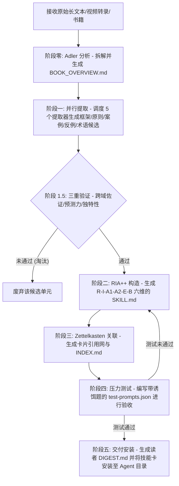

# Cangjie Skill (仓颉方法论蒸馏技能)

Cangjie Skill 是一个用于将书籍、长视频转录、播客及访谈等长文本沉淀，抽取、验证并蒸馏为 AI Agent 可调用的模块化技能（`SKILL.md`）的框架与工具包。

它解决了“收藏了大量高价值内容但无法被 Agent 调用或在实际决策中复用”的真实痛点，通过规范化的 **RIA-TV++** 管道，将压缩总结性笔记升华成场景触发、高度结构化的执行工具。

---

## 🛠️ 第一阶段：环境自检与首次初始化引导

在调用 Cangjie Skill 开启方法论蒸馏前，AI 代理或开发人员必须核对以下环境依赖。

### 1. 运行依赖与自检命令

Cangjie Skill 主要是基于 Prompt 模板与 Markdown 结构的方法论管道。请在终端执行以下指令检查运行环境：

```powershell
# 验证 Python 环境 (若需要运行 star-history 折线图自动绘制脚本)
python --version

# 验证各提取器 Prompt 模板文件是否完整在位
Get-ChildItem tools/cangjie-skill/extractors/
```

### 2. 缺失依赖的自愈与安装

根据运行环境自检的结果，如果有依赖缺失，请按照以下指引进行安装与修复：

* **系统 Python 环境缺失**：
  - 请前往 [Python 官网](https://go.dev/) 下载安装 Python 3.10+，并将其添加到系统环境变量中。
* **提取器 Prompt 缺失**：
  - 确认 `extractors/` 目录中包含以下 5 个关键的提取器模块，它们将在并行提取阶段被调用：
    - `case-extractor.md`（案例提取器）
    - `counter-example-extractor.md`（反例提取器）
    - `framework-extractor.md`（框架提取器）
    - `glossary-extractor.md`（术语词典提取器）
    - `principle-extractor.md`（原则提取器）

### 3. 首次使用与初始化配置

* **元技能加载**：本工具无任何云端 API 凭证或数据库授权。
* **自愈与配置方法**：要让您的 AI Agent（如 Claude Code, Codex, Windsurf）习得并使用此项技能，只需引导 Agent 读取本目录下的 [SKILL.md](SKILL.md) 核心规范文档即可。Agent 在阅读此规范后，即可自动掌握执行 RIA-TV++ 蒸馏管道的能力。
* **推荐配合**：如果要蒸馏视频内容，建议搭配 `video-downloader` 技能（或 `video-batch-download`）一起使用，先提取视频音频的 Whisper 转录文本，再交由 Cangjie Skill 抽提技能。

---

## 🚀 第二阶段：核心执行工作流

元技能加载完毕后，即可开启将长文本素材提炼为高保真技能的 7 阶段工作流。

### 1. RIA-TV++ 蒸馏管道与路由机制

Cangjie Skill 使用 **RIA-TV++** 核心流程将原始素材蒸馏为多技能卡，其工作流路由如下图：



#### 📄 卡片六维结构（RIA++）排版：
生成的每一个独立 `SKILL.md` 均会按照以下格式精心排版：
- **R (Reading)**：原文精彩引用。
- **I (Interpretation)**：用自己的话进行技术/逻辑转述。
- **A1 (Appropriation - Case)**：书中的实际应用案例。
- **A2 (Appropriation - Scenario)**：面向未来的具体触发场景与决策点。
- **E (Execution)**：Agent 可执行的具体执行指令步骤。
- **B (Boundary)**：该技能的适用边界、限制与盲区。

### 2. 命令行与模板调用指南

开发人员或 AI 代理在执行蒸馏时，可以直接采用 `templates/` 下的各类脚手架文件进行填充：

* **核心技能卡模板**：
  直接引用并填充 [templates/SKILL.md.template](templates/SKILL.md.template)。
* **测试用例模板**：
  直接引用并填充 [templates/test-prompts.json.template](templates/test-prompts.json.template)。
* **全局概览与索引模板**：
  使用 [templates/BOOK_OVERVIEW.md.template](templates/BOOK_OVERVIEW.md.template) 以及 [templates/INDEX.md.template](templates/INDEX.md.template)。
* **绘制 Star 变化趋势图（开发维护）**：
  在配置了 Python 依赖后，在命令行运行：
  ```powershell
  python scripts/generate_star_history.py
  ```

### 3. 工具卸载方法

如果您希望从系统及主收藏仓库中安全地移除 Cangjie Skill，只需执行以下步骤：
1. 物理删除个人收藏仓库中的子目录：`tools/cangjie-skill/`。
