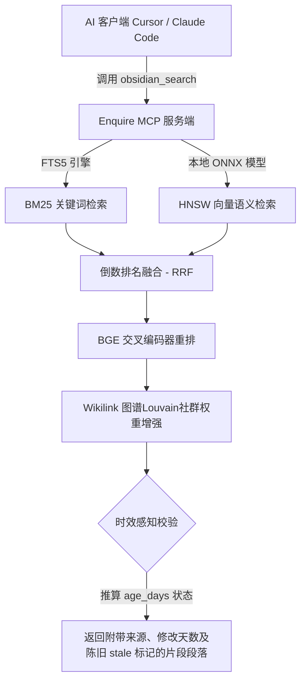

# Enquire MCP (Obsidian 智能体长期记忆与检索服务端)

Enquire MCP 是一个面向 AI 智能体（如 Claude Code, Cursor, Claude Desktop 等）打造的 Obsidian 长期记忆与混合检索服务端。

它将您的本地 Obsidian 仓库（Vault）作为 AI 的外部记忆，通过本地运行的向量模型和时效感知技术，使 AI 能够在多次会话、多个模型中无缝读取、检索和追加您的私人知识，实现完全本地化、隐私受保护的混合搜索。

---

## 🛠️ 第一阶段：环境自检与首次初始化引导

在调用 Enquire MCP 为智能体建立记忆前，请检查您的运行环境。

### 1. 运行依赖与自检命令

本系统是一个基于 Node.js 与 TypeScript 开发的命令行应用。在终端执行以下指令检查基础环境：

```powershell
# 1. 验证 Node.js 运行环境 (需 Node.js 18+ 与 npm)
node -v
npm -v

# 2. 运行健康检查脚本对指定仓库进行诊断
npx -y @oomkapwn/enquire-mcp doctor --vault <你的Obsidian仓库绝对路径>
```

### 2. 首次使用与初始化配置自愈

* **完全本地运行，零云端调用**：
  为确保数据隔离，本项目的向量嵌入和重排模型一律在本地执行，数据绝不离开您的设备。
* **索引初始化与模型下载自愈**：
  在首次启动前，必须运行 `setup` 命令。该命令会自动检测环境并引导下载本地 ONNX 向量编码模型（约 110 MB），并在本地为您的笔记仓库构建 SQLite FTS5 全文索引与 HNSW 向量数据库：
  ```powershell
  npx @oomkapwn/enquire-mcp setup --vault <你的Obsidian仓库绝对路径>
  ```
* **PDF 图文与 OCR 识别（可选）**：
  若您的笔记包含 PDF 扫描版图文附件，系统会通过本地 Tesseract.js 进行多语言 OCR 图像提取。

---

## 🚀 第二阶段：核心执行工作流

初始化自愈就绪后，即可启动服务并配置您的 AI 智能体进行调用。

### 1. 混合检索与时效感知路由路由机制

Enquire MCP 的核心是对笔记全文、双向链接图以及文件修改天数进行多通道混合检索，处理逻辑如下：



* **时效性优先**：在 Memora 检索基准下，系统会将笔记的修改时间转为 `age_days` 和 `stale` 指示，并支持在参数中加上 `--recency-weight` 进行时效加权排序，避免 AI 采纳陈旧事实。
* **丰富工具集**：提供 46 个工具（包含 34 个常驻读工具、7 个高风险写入工具以及 Louvain 社区社群检测 GraphRAG 增强）。

### 2. 客户端服务配置指南

#### 🤖 在 Claude Code (终端) 中接入：
运行以下指令在全局一键注册 MCP 服务：
```powershell
claude mcp add obsidian -- npx -y @oomkapwn/enquire-mcp serve --vault <你的Obsidian仓库绝对路径>
```

#### 💻 在 Cursor (桌面客户端) 中配置：
1. 打开 Cursor，选择 `Settings -> Models -> MCP`。
2. 添加一个新 Server，在类型中选择 **`command`**。
3. 在启动命令行中填入（添加持久化索引和精准重排器）：
   ```powershell
   npx -y @oomkapwn/enquire-mcp serve --vault <你的Obsidian仓库绝对路径> --persistent-index --enable-reranker --use-hnsw
   ```

#### 🌐 远程 HTTP SSE 模式：
支持通过带 Bearer 令牌鉴权的 HTTP 端点以 SSE 会话提供服务，以便为移动端或云端 AI 工具授权访问记忆。详见本地 `examples/` 配置。

### 3. 工具安全卸载方法

如果您需要移除此记忆辅助工具，请执行：
1. 物理删除个人工具收藏仓库中的子目录：`tools/enquire-mcp/`。
2. 物理清除全局 npm 安装：
   ```powershell
   npm uninstall -g @oomkapwn/enquire-mcp
   ```
3. 物理删除系统用户主目录下缓存的 ONNX 向量模型文件与本地索引库以释放空间。
