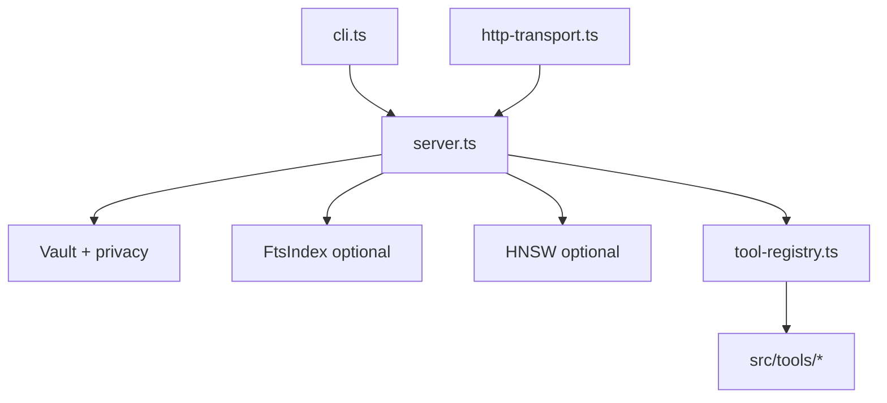

# Аудит проекта enquire-mcp (v3.6.0)

**Репозиторий:** https://github.com/oomkapwn/enquire-mcp  
**Дата аудита:** 2026-05-15  
**Метод:** read-only анализ кода и документации (клон в `/tmp/enquire-mcp-audit`). Тесты и `npm run build` не запускались (кроме `npm audit` prod: 0 уязвимостей).

---

## Краткое резюме

**enquire-mcp** (v3.6.0) — зрелый MCP-сервер для Obsidian с сильной защитой путей, privacy-фильтрами, 714 unit-тестами и продуманным CI.

Главные риски: возможное **уничтожение `.embed.db`** при `serve --use-hnsw`, если индекс собран с моделью, отличной от дефолтной; **дефолтный reranker** (`rerank-multilingual`) по CHANGELOG может не работать, в отличие от `rerank-bge`; **сломанный CI-инвариант** проверки таблицы в `docs/api.md`; ряд расхождений в документации (v2.0 beta, Node 20, `hnswlib-wasm`).

---

## Обзор проекта

| Аспект | Детали |
|--------|--------|
| **Назначение** | MCP-сервер для чтения/поиска/записи в Obsidian-vault: гибридный поиск (BM25 + TF-IDF + embeddings + RRF), PDF/OCR, `.base`, GraphRAG-light, HTTP transport |
| **Версия** | `3.6.0` (`src/index.ts:37`, `package.json:4`) |
| **Стек** | TypeScript (strict), Node ≥20 (фактически PDF/HNSW требуют ≥22.13), MCP SDK, Zod 4, optional: `better-sqlite3`, `@huggingface/transformers`, `hnswlib-node`, `pdfjs-dist`, `tesseract.js` |
| **Точка входа** | `dist/index.js` → `cli.ts` (12 subcommands), `server.ts` (MCP), `tool-registry.ts` (44 tools), `prompts.ts` (19 prompts) |
| **Структура** | `src/` — 28 модулей после split v3.6; `tests/` — 33 файла; `docs/`, `scripts/`, `.github/workflows/` |

### Архитектура (упрощённо)

---

## Критические находки

- **`serve --use-hnsw` может уничтожить embedding-индекс при другой модели** — `src/server.ts:194-212`: при построении HNSW открывается `EmbedDb` с `resolveModel(undefined)` → всегда `multilingual`. Если `build-embeddings` делали с `--embedding-model bge`, `bootstrapSchema()` в `embed-db.ts:263-271` при несовпадении `model_alias` **DROP TABLE embeddings** — данные индекса стираются при каждом старте с `--use-hnsw`. Флаг `--embedding-model` есть только у `build-embeddings` / `setup` / `eval`, **не у `serve`**.

- **Дефолтный cross-encoder reranker может быть нерабочим** — `DEFAULT_RERANKER_ALIAS = "rerank-multilingual"` (`src/embeddings.ts:293`). CHANGELOG v3.6.0: только `rerank-bge` проверен end-to-end; 4 других алиаса «fail at AutoTokenizer» до v3.7. Пользователь с `--enable-reranker` без `--reranker-model rerank-bge` может не получать реального rerank (или ошибку в `signal_errors.reranker`).

- **Сломанный тест покрытия таблицы `docs/api.md`** — `tests/docs-consistency.test.ts:416-427` парсит `registerTool(` из `src/index.ts`, но регистрация в `src/tool-registry.ts` (44 вызова). `registered` = ∅ → тест **всегда проходит** и не ловит пропуски в таблице. Комментарий в `tests/no-internal-imports.test.ts:13-15` это признаёт.

---

## Высокий приоритет

- **`obsidian_query_base`: неверный `total_matched`** — `src/bases.ts:277,321-323`: цикл прерывается при `matches.length >= limit`, но `total_matched: matches.length` — это число **возвращённых** строк, а не всех совпадений в vault.

- **Пермиссивная семантика `.base` DSL** — `src/bases.ts:339-363`: нераспознанные предикаты → `unevaluated` и **`return true`**. Возможны ложные срабатывания (over-inclusion). Формулы не вычисляются.

- **Устаревший заголовок `docs/api.md`** — строки 4–5: «v2.0 beta», «stable v1.x — 28 tools» против 44 tools / v3.6.0.

- **README: badge «v3.5.x-stable» при версии 3.6.0** — `README.md:15` vs `package.json:4`.

- **`package.json` engines: `>=20` vs реальность** — CI убрал Node 20; `pdfjs-dist` требует ≥22.13.

- **Неверная справка CLI для HNSW** — `src/cli.ts:95`: «Requires `hnswlib-wasm`»; фактически `hnswlib-node`.

- **HNSW + несовпадение модели (поиск)** — рассинхрон HNSW-векторов и запросов при нестандартной модели индекса.

---

## Средний приоритет

- Токенная усечка embeddings (max 128 tokens) — снижение recall.
- `searchText` / `semanticSearch` — O(n) по vault.
- `obsidian_get_communities` — полное чтение vault.
- HTTP rate limiter: неограниченный `Map`.
- Stateful HTTP: гонки при инициализации.
- `docs/api.md`: дублирование секций.
- Reranker smoke не в обязательном CI.
- Покрытие веток ~75% (порог 74%).

---

## Низкий приоритет

- Опечатка `ssylaetsja` в `tests/no-internal-imports.test.ts:21`.
- Badge README «MCP 1.29» vs SDK `^1.0.4`.
- `zod` v4 — новая major.
- `prepare` hook всегда запускает `tsc`.
- Shallow clone — полная история не анализировалась.

---

## Документация

| Проблема | Где |
|----------|-----|
| Устаревший канал «v2.0 beta» / v1.x 28 tools | `docs/api.md:4-5` |
| Badge stable v3.5.x vs 3.6.0 | `README.md:15` |
| CLI help: hnswlib-wasm вместо hnswlib-node | `src/cli.ts:95` |
| engines Node ≥20 vs CI ≥22 | `package.json`, `ci.yml` |
| CHANGELOG про reranker — README не акцентирует | `CHANGELOG.md:64`, `README.md` |

**Сильные стороны:** `TOOL_MANIFEST`, `STABILITY.md`, `SECURITY.md`, TypeDoc + publish-docs.

**Пробел:** нет матрицы «флаг CLI → tools» в одной таблице.

---

## Тесты и качество

| Метрика | Значение |
|---------|----------|
| Файлов тестов | 33 |
| `it()` блоков | 714 |
| Пороги coverage | lines ≥86%, branches ≥74% |
| Security | `tests/security.test.ts` |
| HTTP | `tests/http-transport.test.ts` — 49 cases |

**Пробелы:** reranker smoke opt-in; тест таблицы api.md — no-op; E2E — только smoke.mjs.

**Не проверялось:** полный `npm test`, benchmarks, SLSA на npm.

---

## Зависимости и безопасность

- npm audit prod: **0 vulnerabilities**
- Сильная модель угроз: realpath, privacy, HTTP bearer, chmod на кэшах
- Риски: persistent cache = чтение vault; `/health` без auth by design

---

## Архитектура и дизайн

**Сильные:** split v3.6, ServerDeps, RRF + graph boost, privacy filter.

**Слабые:** `serve` без sync embedding-model; дублирование sync в server.ts; partial `.base` DSL.

---

## Рекомендации по улучшению

1. **Критично:** при `--use-hnsw` читать meta из `.embed.db` до `bootstrapSchema`, или `serve --embedding-model`.
2. **Критично:** DEFAULT_RERANKER → `rerank-bge` или fail-fast.
3. **Критично:** исправить docs-consistency.test.ts (tool-registry / TOOL_MANIFEST).
4. **Высокий:** `total_matched` в queryBase отдельно от limit.
5. **Высокий:** обновить api.md, README, engines, CLI help.
6. **Высокий:** strict mode для `.base` DSL.
7. **Средний:** reranker-smoke в release.yml.
8. **Средний:** peekEmbedDbMeta для doctor.
9. **Низкий:** PROMPT_MANIFEST.

---

## Положительные стороны

- Сильный security posture для MCP.
- 714 тестов, 7 CI gates, SLSA-3.
- Честный CHANGELOG, TOOL_MANIFEST.
- Graceful degradation, read-only by default.
- TypeDoc + benchmarks.

---
