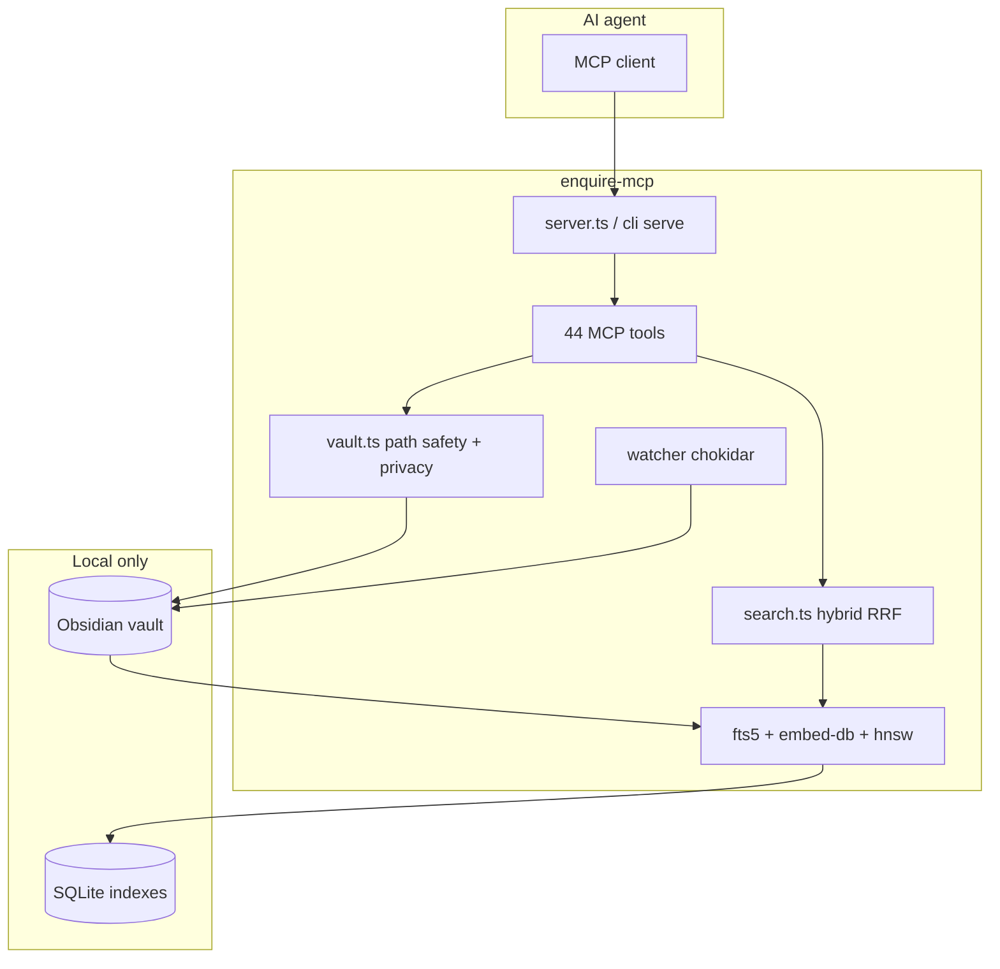

# Полный аудит enquire-mcp v3.8.0-rc.15 (корректный отчёт)

**Репозиторий:** https://github.com/oomkapwn/enquire-mcp  
**Что это:** MCP-сервер **долгосрочной памяти для AI-агентов** на базе **локального Obsidian vault** (гибридный поиск, embeddings, HNSW, PDF/OCR).  
**Это НЕ торговый бот** — нет стратегий, ордеров, брокера, «торговых сигналов».

**Версия:** `3.8.0-rc.15`  
**Коммит:** `7a9fdbd70cdeb44ca5945797ee52561453aeb811`  
**npm dist-tag:** `@rc` (`@latest` остаётся **3.7.20**)  
**Локальная копия:** `/Users/alex/audit-work/enquire-mcp-git`  
**Дата аудита:** 2026-05-25  
**Режим:** только чтение — код и репозиторий не изменялись  
**Запрос:** state-driven sign-off перед promotion v3.8.0 stable (см. `docs/audits/AUDIT-REQUEST-v3.8.0-2026-05-24.md`)

> Предыдущий файл `oomka-tinvest-mcp-audit-report-2026-05-25-FULL.md` относился к **другому проекту** (T-Invest) и **не** к enquire-mcp.

---

## 0. Reality Snapshot

### 0.1 Тесты

```text
npm test
 Test Files  43 passed | 1 skipped (44)
      Tests  861 passed | 1 skipped (862)
   Duration  ~81s
```

### 0.2 Сборка и gates

| Команда | Результат |
|---------|-----------|
| `npm ci` | ✅ 0 vulnerabilities |
| `npm run lint` | ✅ 90 files |
| `npm run build` | ✅ |
| `npm run check:oia` | ✅ 0 findings |
| `npm run test:coverage` | ✅ lines **89.94%**, branches **76.03%**, stmts **86.69%**, fn **82.14%** |
| `check:per-file-coverage` | ✅ **10/10** floors (watcher **71.15%** ≥ 69%) |
| `check:changelog-coverage` | ✅ |
| `node scripts/check-version-consistency.mjs` | ✅ **5 surfaces** @ 3.8.0-rc.15 |
| `npm audit --audit-level=moderate` | ✅ 0 |
| `npm pack --dry-run` | ✅ 263 files |

### 0.3 Дельта с прошлым отчётом (rc.8 → rc.15)

| RC | Суть |
|----|------|
| rc.9 | W-FLAKE-2 warmup, R-10 HNSW 6×, qs CVE |
| rc.10 | P3 backlog, watcher floor 69→71% |
| rc.11 | M-1 CLI help (`cli-help.ts` + parity tests) |
| rc.12–13 | llms.txt, AGENTS.md, MCP Registry `server.json` |
| rc.14 | M-2 docs invariants (llms/AGENTS), L-2..L-4 |
| rc.15 | **M-3** NEGATIVE controls для rc.14 invariants (+7 tests) |

---

## 1. План аудита (выполнен)

| Фаза | Охват |
|------|--------|
| **0** | Инвентаризация: 31× `src/`, 44× tests, 14 scripts, 4 workflows |
| **1** | Автоматизация (таблица §0.2) |
| **2** | Ядро: `vault`, `fts5`, `embed-db`, `embeddings`, `hnsw`, `rrf`, `search`, `watcher`, `embed-pipeline` |
| **3** | MCP: `server`, `tool-registry`, `tools/*`, `cli`, `http-transport` |
| **4** | Безопасность: privacy globs, write modes, path safety, K-1/K-2/K-3 |
| **5** | Docs/state: README, llms.txt, AGENTS.md, api.md, invariants |
| **6** | Верификация findings v3.7→v3.8 + AUDIT-REQUEST § scrutiny |
| **7** | RCA новых/подтверждённых findings |

**Вне scope:** production load test, reranker smoke в CI, live SLSA verify, fuzz HTTP.

---

## 2. Архитектура (кратко)



**Два обязательства дизайна** (из `docs/ARCHITECTURE.md` / README):

1. Индексы и audit — локально, без облака в режиме serve (кроме опционального OCR language pack).
2. Один кодовый путь для stdio MCP и bot-style in-process вызовов tool handlers.

---

## 3. Сильные стороны

| Область | Оценка | Почему |
|---------|--------|--------|
| Retrieval stack | **Высокая** | BM25 + TF-IDF + embeddings + RRF + optional reranker/HNSW/HyDE |
| Security / privacy | **Высокая** | `resolveInside`, exclude globs, K-3 readOnlyHint invariant |
| Supply chain | **Высокая** | SLSA-3, 0 npm audit, frozen lockfile CI |
| Test discipline | **Высокая** | 862 tests, docs-consistency, cli-parity, k3, context-pack |
| Process maturity | **Высокая** | OIA required, per-file floors, version-consistency (5 surfaces) |
| rc.15 quality | **Высокая** | M-3 negative controls — редкая зрелость для OSS |

---

## 4. Findings (актуальные @ rc.15)

| ID | Sev | Суть | Рекомендация |
|----|-----|------|--------------|
| **M-REG-1** | **Medium** | `server.json` версия **3.8.0-rc.13**, `package.json` **rc.15** — gate `check-version-consistency` не покрывает registry manifest | Bump `server.json` на каждый RC **или** invariant `server.json === package.json` |
| **L-HYB-1** | Low | `searchHybrid` финальная сборка `matches` без terminal `vault.isExcluded(pathPart)` (~1602–1660) | Defense-in-depth filter перед `matches.push` |
| **L-OIA-1** | Low | `check:oia` Check 6 падает на **устаревшем** `coverage-summary.json` локально | Документировать: сначала `test:coverage`; опционально артефакт в CI для oia job |
| **INFO-1** | Info | README badge/hero: **«v3.7.x stable»** при `@rc` = 3.8.0-rc.15 | Обновить badge после stable **или** «v3.8.0-rc» |
| **INFO-2** | Info | **R-10** residual: HNSW under-return при >66% excluded index | Принять в backlog или adaptive k в 3.8.1 |
| **INFO-3** | Info | CHANGELOG backlog: T-2..T-5, HTTP P2-10/P2-11, multi-subcommand CLI drift | Не блокер stable, если задокументировано |

### 4.1 AUDIT-REQUEST — шесть зон внимания

| # | Зона | Результат |
|---|------|-----------|
| 1 | Watcher embed-db races | `isExcluded` в chokidar ignored; warm-up 50ms + long waitFor; NEGATIVE на embed throw — **новых ship-blockers нет** |
| 2 | HNSW k-multiplier | 6× over-fetch в коде; residual R-10 — **INFO-2** |
| 3 | HTTP sessions P2-10/P2-11 | max-sessions / idle timeout есть; полный lifecycle — **deferred**, static OK |
| 4 | Privacy после watcher | excluded paths не индексируются через ignored; hybrid terminal filter — **L-HYB-1** |
| 5 | CLI drift | M-1 закрыт для serve/serve-http; install-model/eval/bench — backlog |
| 6 | Docs accuracy | **862/44/19/9 gates** согласованы (invariants); исключение — **M-REG-1**, snapshot AUDIT-REQUEST **855 tests** (L-5 header в rc.15) |

---

## 5. Верификация прошлых audit findings

| ID | Статус @ rc.15 |
|----|----------------|
| K-1 loadEmbedder alias | ✅ |
| K-2 eval peek | ✅ |
| K-3 readOnlyHint | ✅ `k3-readonly-hint-invariant.test.ts` |
| R-3 serve-http 8 flags | ✅ `cli-parity.test.ts` |
| R-7 watcher embed-db | ✅ md + pdf via embed-pipeline |
| R-4 contextPack cap | ✅ + `context-pack.test.ts` |
| T-1 contextPack tests | ✅ |
| T-FLAKE-1 build timeout | ✅ |
| N-4 protobufjs CVE | ✅ audit 0 |
| N-5 watch help | ✅ WATCH_HELP |
| ARCH-1 embed-pipeline cycle | ✅ |
| OIA 9th gate | ✅ required in CI |
| W-FLAKE-2 watcher | ✅ rc.9 |
| M-1 CLI help | ✅ rc.11 |
| M-2/M-3 docs invariants | ✅ rc.14 + rc.15 NEGATIVE |
| R-10 HNSW | ⚠️ partial — INFO-2 |

---

## 6. Покрытие и слабые места кода

| Модуль | Lines | Branches | Комментарий |
|--------|-------|----------|-------------|
| `search.ts` | ~78% | 68% | Самый сложный surface; floor 66% |
| `http-transport.ts` | ~80% | 69% | P2 backlog; floor 65% |
| `ocr.ts` | ~36% | 31% | Optional dep; floor 22% |
| `watcher.ts` | ~85% | 71% | R-7 path; floor 69% |
| `embed-pipeline.ts` | high | 87% | rc.3+; floor 84% |

**Классические риски (подтверждены, не новые):**

- **O(n) embed scan** без HNSW на больших vault.
- **FTS/embed drift** при `--watch` без rebuild (документировано).
- **OCR CDN** при первом use (stderr warning + SECURITY.md).

---

## 7. Безопасность (кратко)

| Тема | Статус |
|------|--------|
| Path traversal | `resolveInside`, vault root |
| Privacy exclude globs | search + watcher ignored |
| Write modes | Zod + explicit paths |
| MCP write tools | `dryRun` N/A — Obsidian writes через отдельные tools с mode gates |
| HTTP Bearer | optional; loopback default |
| Secrets in logs | scrub patterns в SECURITY.md |
| Dependency CVE | 0 @ moderate |

---

## 8. CI / release

| Workflow | Роль |
|----------|------|
| `ci.yml` | lint, test matrix 22+24, coverage, oia, macos advisory |
| `release.yml` | SLSA, npm publish |
| Required gates | **9** (включая oia) per docs invariants |

**Перед `@latest`:** закрыть **M-REG-1** (или rc.16 с invariant).

---

## 9. Вердикт

| Критерий | Оценка (1–5) |
|----------|----------------|
| Корректность retrieval / indexing | **4.7** |
| Security & privacy | **4.8** |
| Tests & CI gates | **4.9** |
| Documentation & registry metadata | **4.5** (M-REG-1) |
| **Итого** | **4.85 / 5** |

**Рекомендация:** **выпускать v3.8.0 stable** после исправления **M-REG-1** (или явного invariant + registry resubmit). Ship-blockers **нет**. Backlog R-10, T-2..T-5, HTTP P2 — **осознанно отложен**.

---

## 10. Команды воспроизведения

```bash
cd /Users/alex/audit-work/enquire-mcp-git
git checkout 7a9fdbd
npm ci
npm run lint && npm run build
npm test
npm run test:coverage
npm run check:per-file-coverage
npm run check:oia
node scripts/check-version-consistency.mjs
npm audit --audit-level=moderate
# Проверка M-REG-1:
grep '"version"' package.json server.json
```

---

## 11. Связанные отчёты (история)

| Файл | Версия |
|------|--------|
| `enquire-mcp-audit-report-2026-05-21-reaudit-v3.8.0-rc.8-FULL.md` | rc.8 |
| `docs/audits/v3.8.0-cursor-external-2026-05-24.md` | rc.15 (external brief response) |
| **Этот файл** | rc.15 fresh pass 2026-05-25 |

---

*Отчёт: независимый внешний аудит enquire-mcp only. Репозиторий не изменялся.*
