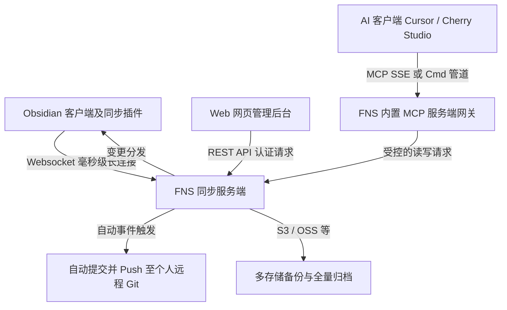

# Fast Note Sync Service (FNS 笔记同步与 MCP 服务平台)

Fast Note Sync Service (简称 FNS) 是一个使用 Go 语言开发的高性能、低延迟的 Obsidian 笔记多端实时同步与在线管理服务平台，同时内置了**原生 MCP (Model Context Protocol) 网关**和标准 REST API。

它能够将您的个人 Obsidian 知识库以极高效率同步至云端，并作为一个安全的本地/远端 MCP 服务，让 AI 客户端（如 Cursor、Cherry Studio）具备安全读写您私人笔记和附件的能力。

---

## 🛠️ 第一阶段：环境自检与首次初始化引导

部署或编译 FNS 同步服务前，AI 代理或开发人员必须检查运行环境。

### 1. 运行依赖与自检命令

本系统包含由 Go 编写的后端主程序以及由 React 编写的网页控制台。请在终端执行以下指令检查运行依赖的就绪状态：

```powershell
# 1. 验证 Go 语言编译环境 (建议 Go 1.21+)
go version

# 2. 验证前端资源编译环境 (若需要修改 Web 控制台)
node -v
npm -v
```

### 2. 首次部署与服务自愈配置

我们提供一键管理脚本与 Docker 部署，能够实现依赖包下载、系统级服务注册和环境配置自愈。

* **方式一：一键自愈安装（推荐）**：
  在 Linux 或 macOS 的 bash 终端中，运行下方指令。脚本将根据您的 CPU 架构拉取最新 Release，并在系统中注册开机自启服务：
  ```bash
  bash <(curl -fsSL https://raw.githubusercontent.com/haierkeys/fast-note-sync-service/master/scripts/quest_install.sh)
  ```
  - 安装程序默认注册全局可执行指令 `/usr/local/bin/fns`。
  - **服务自动修复与诊断命令**：
    - `fns start`（启动同步服务）
    - `fns stop`（暂停服务）
    - `fns status`（检测服务运行状态）
    - `fns menu`（调出交互式管理菜单，用于升级和切换镜像）
* **方式二：Docker 容器部署**：
  您可以使用项目自带的 [docker-compose.yaml](scripts/docker-composer/docker-compose.yaml) 文件拉起容器实例。

### 3. 数据库与初始化配置自愈

* **内置数据库自愈**：项目启动时默认使用本地 SQLite 数据库文件。如果您在配置中选择连接 MySQL 或 PostgreSQL，系统会自动检查并运行 `scripts/db.sql` 结构文件以自动初始化表。
* **本地配置文件**：默认安装于 `/opt/fast-note/config.yaml`。启动前需确认配置中的数据存放路径已获得适当的系统读写授权。

---

## 🚀 第二阶段：核心执行工作流

服务正常运行后，即可配置多端 Websocket 实时同步并允许 AI 通过 MCP 协议网关读写笔记。

### 1. 多端同步与 AI MCP 路由路由机制

FNS 本身扮演着中继和网关的角色，核心消息与读写处理流程如下：



* **安全合并策略**：离线编辑重连后自动应用合并逻辑，删除动作自动判定以防止文件意外丢失。
* **MCP 网关的重大意义**：它无需将您的笔记文件夹暴露给外部，只需将 FNS 作为 MCP 服务注册，AI 即可在对话中实时检索、编写、或修改您的 Obsidian 私人卡片，并实时推送到手机和电脑的客户端上。

### 2. AI 接入与 API 调用指南

#### 🤖 将 FNS 接入 AI 客户端 (Cursor) 的 MCP 配置：
1. 打开 Cursor 客户端，导航至 `Settings -> Models -> MCP`。
2. 添加一个新 Server，在类型中选择 **`command`**。
3. 填入启动命令与配置端点（以 FNS 默认运行在 `localhost:8080` 为例）：
   ```powershell
   # 绑定本地 FNS 暴露的 MCP 网关执行程序
   /opt/fast-note/fns-mcp --server-url http://127.0.0.1:8080 --token YOUR_VAULT_TOKEN
   ```
4. 连接成功后，Cursor 即可调用 `fns` 相关的工具集读写笔记。

#### 🚀 REST API 编程接口：
* 支持外部工具和自动化脚本通过 REST 协议管理笔记。
* 接口规范文档详见本地文件：
  - 接口配置与说明：[REST_API.md](docs/REST_API.md)
  - 架构数据模型：[swagger.yaml](docs/swagger.yaml)

### 3. 服务安全卸载方法

如果您需要完全移除本同步服务，请执行：
1. 运行一键卸载脚本清理 Systemd/Launchd 系统级服务与二进制文件：
   ```powershell
   fns uninstall
   ```
2. 物理删除工具收藏仓库中的子目录：`tools/fast-note-sync-service/`。
