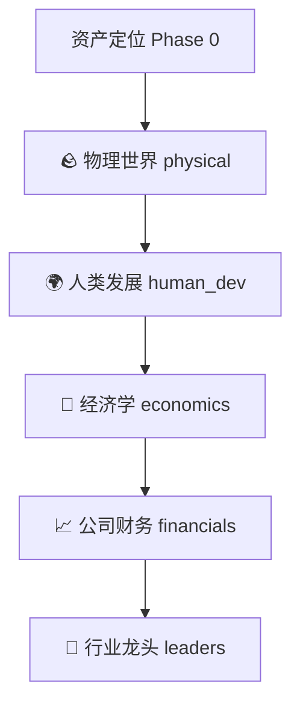

# 🧠 cyberagent —— 物理瓶颈 · 反共识投资分析框架

一条 LLM 智能体链，把任意标的一层层拆到卡住它所在产业的**物理约束**，核对市场**是否已经定价**，并**拒绝追逐叙事驱动的尖顶**。覆盖 A 股 / 港股 / 美股。

---

## 🛠️ 第一阶段：环境自检与首次初始化引导

在使用 `cyberagent` 进行反共识投资分析前，请先完成环境的体检自检与初始化配置。

### 1. 运行环境自检
AI Agent 在首次运行或调试时，需依次检查以下环境依赖：
- **Python 版本检测**：确保系统安装了 Python 3.9 或更高版本。
  ```bash
  python3 --version
  ```
- **核心依赖包检测**：运行以下命令，检查 `cyberagent` 是否已安装，以及其依赖是否完整。
  ```bash
  python3 -c "import cyberagent; print(cyberagent.__version__)"
  ```
  如果系统提示 `ModuleNotFoundError`，请参考下方依赖安装指南进行自动/手动安装。

### 2. 依赖安装与缺失修复
如果检测到环境依赖缺失，请根据需要执行对应的安装命令：
- **全套安装（推荐，包含所有模型 provider、数据行情与本地网页）**：
  ```bash
  python3 -m pip install 'cyberagent[all]'
  ```
- **精简安装（仅安装特定模型接口与数据）**：
  例如，若仅使用 DeepSeek 并分析 A 股与美股数据，可运行：
  ```bash
  python3 -m pip install 'cyberagent[stocks,deepseek]'
  ```
  > [!TIP]
  > 强烈建议在虚拟环境（venv）中进行安装，以避免 macOS 等系统的权限与命令冲突：
  > ```bash
  > python3 -m venv .venv
  > # Windows 激活虚拟环境
  > .venv\Scripts\activate
  > # macOS/Linux 激活虚拟环境
  > source .venv/bin/activate
  > ```

### 3. 本地凭证与 API 密钥的自愈配置
本工具需要大语言模型的 API 密钥（API Key）方可运行。在首次启动时，工具提供交互式自愈配置：
- **交互式向导自动检测**：
  运行裸命令 `cyberagent`，向导会自检环境变量或本地 `.env`。若检测不到对应的 key，会显示 `—` 并提示您粘贴输入。您可以在粘贴后选择 `[Y/n]` 保存至本地 `.env` 文件中，下次即可免输直接运行。
- **手动快速配置（.env）**：
  在项目根目录下创建 `.env` 文件，并根据要使用的模型，填入以下对应的 API 密钥：
  ```env
  GEMINI_API_KEY="您的Gemini_API_Key"       # 默认且唯一支持实时搜索（Grounding）的模型
  OPENAI_API_KEY="您的OpenAI_API_Key"
  DEEPSEEK_API_KEY="您的DeepSeek_API_Key"
  ANTHROPIC_API_KEY="您的Claude_API_Key"
  ```

---

## 🚀 第二阶段：核心执行工作流

配置完成后，即可进入核心投资分析工作流。

### 1. 核心执行逻辑与部门路由机制
`cyberagent` 的核心是一台**由宏观物理现实缩放到具体微观标的**的分析望远镜。每次分析会顺序流转 5 个核心分析部门，前一步的产出会作为下一步的输入：



- **Phase 0 · 资产定位**：确定目标标的核心产品与业务，将其定位到物理/AI供应链的具体层级（如衬底、先进封装、特定材料等）。
- **部门 1 · 🪨 物理世界 (physical)**：定位产业链底层的物理约束（如电力、CoWoS/HBM等），判断标的是否拥有垄断的瓶颈所有权。
- **部门 2 · 🌍 人类发展 (human_dev)**：将标的的需求放到 AGI 发展弧线（OOM 扩张）上，评估其所处的生命周期阶段。
- **部门 3 · 💱 经济学 (economics)**：分析标的是原材料销售商（Ore-seller）还是加工商（Processor），计算估值是否已被市场合理定价（是否已成“响亮共识”）。
- **部门 4 · 📈 公司财务 (financials)**：评估基本面数据，捕捉是否有非线性的财务弹性或潜在红旗警告。
- **部门 5 · 🎯 行业龙头 (leaders)**：根据“瓶颈身份”与“定价位置”进行最终双轴判定，生成 steelman 论证及退出信号。

### 2. 核心命令手册与运行参数
本工具支持交互式向导、CLI 非交互命令行以及 Web 界面运行。

#### 命令行交互向导
```bash
cyberagent
```
按照屏幕指示，依次选择：语言 (zh/en) → 目标模型 → 粘贴/保存 API Key → 输入标的代码（如 `NVDA`、`600519`、`0700`）。

#### 非交互命令行分析
```bash
# 使用 Gemini 模型进行中文分析（包含实时搜索）
cyberagent analyze NVDA --llm gemini --lang zh

# 仅调用部分部门（物理、经济、行业龙头），跳过其它部门以加快速度
cyberagent analyze AAPL --depts physical,economics,leaders

# 禁用 Gemini 的实时搜索 Grounding 功能
cyberagent analyze MRVL --no-grounding
```

#### 本地网页服务
```bash
cyberagent serve --host 127.0.0.1 --port 8000
```
运行后在浏览器中打开 `http://127.0.0.1:8000`，即可使用带模型选择器、各部门进度实时渲染的可视化分析界面。

#### Python API 集成
可以在您自己的 Python 异步脚本中调用 `AnalystChain`：
```python
import asyncio
from cyberagent import AnalystChain

async def run_analysis():
    # 初始化分析链
    chain = AnalystChain(llm="gemini", api_key="您的API密钥", lang="zh")
    # 执行分析
    report = await chain.analyze("NVDA")
    
    print("最终判定决策:", report.final_decision)  # ACCUMULATE / HOLD / REDUCE / AVOID
    print("行业龙头报告:", report.departments["leaders"].markdown)

if __name__ == "__main__":
    asyncio.run(run_analysis())
```

### 3. 卸载方法
如果需要彻底清理并卸载本工具，请在终端执行：
```bash
pip uninstall cyberagent
```
