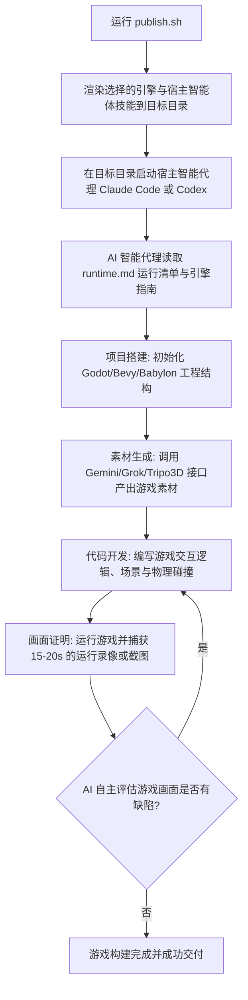

# godogen - 基于 Godot、Bevy 与 Babylon.js 的自主游戏开发生成器

本工具（Godogen）是一个由 AI 智能代理（如 Claude Code 或 Codex）主导的自主游戏开发生成器。用户只需描述想要的游戏类型，AI 智能代理便会自动编写游戏代码、生成所需的 3D 或 2D 素材、运行游戏引擎并基于实际的游戏运行画面（录屏或截图）进行迭代调试，直至交付一个完整可玩的游戏。

本项目的核心逻辑是：**godogen 项目源码 -> 发布出专属游戏仓库 -> 由 AI 智能代理在专属仓库中构建出最终游戏**。

---

## 🛠️ 第一阶段：环境自检与首次初始化引导

为了能够顺利发布并让 AI 智能代理自主构建游戏，请确保本地开发环境满足以下依赖，并配置好素材生成的 API 密钥。

### 1. 系统要求与引擎自检

根据您选择发布的游戏引擎，本地系统需要预先安装对应的开发环境并将其配置到系统 `PATH` 环境变量中：

*   **Godot 4 引擎**：需要本地安装有 **Godot 4 (.NET 版本/支持 C#)**，并且 `godot` 可执行程序在系统 `PATH` 中。
*   **Bevy 引擎**：需要本地安装有 **Rust 语言环境与 Cargo 工具链**。
*   **Babylon.js 引擎**：需要本地安装有 **Node.js 22.12+** 以及 **npm**。
*   **无头运行与捕获依赖**（用于录制运行画面以供 AI 评估）：
    *   在 Linux 下需要安装 `xvfb` 以实现无显示器的虚拟渲染。
    *   通用系统依赖：需要在本地系统安装 `vulkan-tools`、`ffmpeg` 以及 `imagemagick`。
    *   Babylon.js 捕获需要安装 Chrome 或 Chromium 浏览器，并确保支持硬件 WebGL2 渲染。
*   **Python 环境**：需要 Python 3 及 pip 包管理器。

### 2. 首次运行的环境自愈

在首次启动或运行发布脚本时，AI 智能代理会自动检测上述依赖（如 `cargo`、`npm`、`ffmpeg` 等）是否在 PATH 中。如果检测到缺失，AI 会引导并提供在不同操作系统（如 macOS、Ubuntu 等）下的安装指令（例如通过运行 `setup.md` 里的环境安装引导）。

### 3. API 凭证与密钥配置

AI 智能代理在自主开发游戏的过程中，会调用云端多模态大模型来生成游戏所需的图片、贴图、视频精灵图（animated sprites）和 3D 模型，需要在运行环境中配置以下 API 密钥作为环境变量：

| 环境变量名称 | 对应的大模型 / 服务平台 | 费用与用途说明 |
| :--- | :--- | :--- |
| `GOOGLE_API_KEY` | [Google AI Studio (Gemini)](https://aistudio.google.com/) | 免费或按量计费；用于生成高质量的参考图片及角色原画。 |
| `XAI_API_KEY` | [xAI Grok](https://console.x.ai/home) | 免费或按量计费；用于生成材质纹理（textures）和简单的循环帧视频。 |
| `TRIPO3D_API_KEY` | [Tripo3D](https://platform.tripo3d.ai/) | 提供 3D 模型生成、图像转 3D 以及双足角色骨骼动画绑定。 |

可以在发布生成的游戏仓库根目录下创建 `.env` 文件，写入上述环境变量：
```env
GOOGLE_API_KEY=your-gemini-key-here
XAI_API_KEY=your-grok-key-here
TRIPO3D_API_KEY=your-tripo3d-key-here
```

---

## 🚀 第二阶段：核心执行工作流

本工具通过将游戏生成框架发布到独立的目标仓库中，由嵌入在该仓库中的 AI 技能包引导智能代理完成全部的构建任务。

### 1. 路由机制与功能优先级

开发一个完整游戏的工作流路由机制如下：



1.  **发布游戏骨架 (Publishing)**：通过 `publish.sh` 将目标引擎的专属技能（如 Godot 场景生成技能、素材生成技能）渲染成一个清爽的扁平化仓库。
2.  **启动自主代理 (Host Agent)**：在新生成的游戏仓库中运行 Claude Code。智能代理将完全根据引擎指南（如 `bevy.md`），自主从零生成项目脚手架。
3.  **素材分流生成**：AI 代理根据游戏文字描述，自动判断需要哪些资产，并行调用 Tripo3D 生成 3D 网格，调用 Grok 自动提取贴图并去除视频背景生成循环的 2D 骨骼动画。
4.  **基于画面反馈的调试 (Proof over claims)**：代理运行游戏并录制 15 秒的实际运行片段。AI 代理根据实际画面是否穿模、是否有视觉逻辑错误来改进代码，而不是单纯依靠编译成功来作为完成标准。
5.  **无人值守与干预**：如果用户在线，可以在调试节点进行实时方向干预；如果用户不在，AI 代理会自动生成最终的游戏录屏证明文件。

### 2. 发布命令手册

在 `godogen` 本地克隆仓库中运行发布脚本，支持以下参数：

*   **--engine**：目标游戏引擎，可选 `godot`、`bevy` 或 `babylon`。
*   **--agent**：宿主智能体，可选 `claude` (输出 CLAUDE.md) 或 `codex` (输出 AGENTS.md)。
*   **--out**：目标输出仓库文件夹路径。
*   **--force**：如果目标目录已存在，强制清空并重新写入。

#### 💻 常用发布命令示例

*   **为 Godot 4 引擎发布一个 Claude Code 驱动的游戏仓库**：
    ```bash
    ./publish.sh --engine godot --agent claude --out ~/my-godot-game
    ```

*   **为 Bevy (Rust) 引擎发布一个 Claude Code 驱动的游戏仓库**：
    ```bash
    ./publish.sh --engine bevy --agent claude --out ~/my-bevy-game
    ```

*   **为 Babylon.js (TypeScript) 网页游戏发布一个 Codex 驱动的游戏仓库**：
    ```bash
    ./publish.sh --engine babylon --agent codex --out ~/my-babylon-game
    ```

### 3. 在服务器上持续运行

由于完整的自主游戏构建可能需要数个小时，建议在 GPU 服务器上后台执行：
*   **保持连接**：通过 `tmux` 或 `screen` 挂起 SSH 会话。
*   **远程控制**：启用 Claude Code 或 Codex 的远程管理端口，从其它终端随时连入观察游戏构建进度。

### 4. 清理与卸载

*   若要清理特定的生成项目，直接物理删除通过 `publish.sh` 导出的目标游戏文件夹即可。
