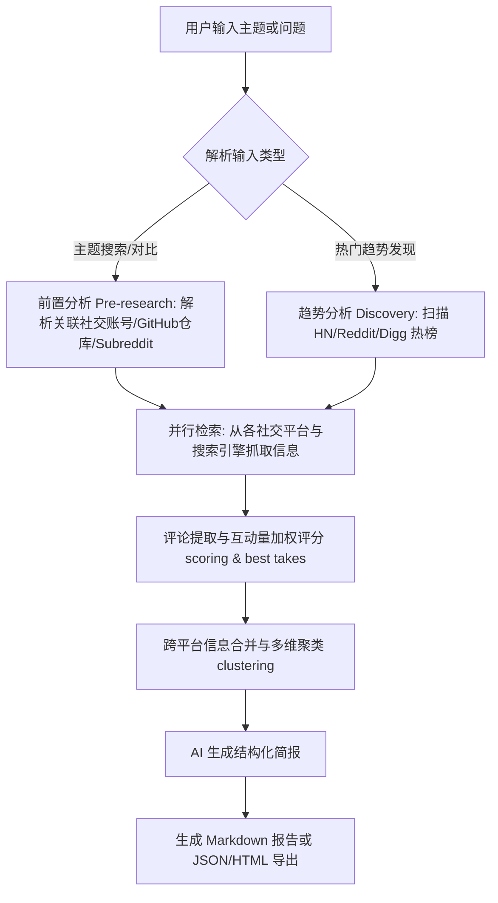

# last30days-skill - AI 驱动的 30 天社交与舆情搜索引擎

本工具是一个由 AI 智能代理主导的舆情与社交搜索引擎。它不依赖网站编辑的推荐，而是通过真实用户的点赞数、喜欢数、互动量以及 Polymarket 预测市场的真实资金投入对信息进行评分和聚合。

它能够并行检索 Reddit、X (Twitter)、YouTube、TikTok、Hacker News、Polymarket、GitHub 以及主流网页，并自动进行跨平台内容聚类与去重，最终由 AI 提炼成一份客观的舆情简报。

---

## 🛠️ 第一阶段：环境自检与首次初始化引导

为了确保本工具可以顺利运行，AI 智能代理或用户需要按以下步骤进行环境的自愈诊断和凭证配置。

### 1. 系统要求与环境自检

*   **运行环境**：系统需要安装 **Python 3.12+**。引擎的底层逻辑基于 Python 编写，若未安装，请前往 Python 官网安装。
*   **其他依赖**：若需要使用部分特定的 X 检索等组件，可能需要在系统 PATH 中安装 Node.js 运行环境。
*   **YouTube 转录抓取**：如果需要抓取并处理 YouTube 视频的完整转录文本，推荐在本地安装 `yt-dlp` 工具（例如在 macOS 上运行 `brew install yt-dlp`）。

### 2. 预检与诊断命令 (Doctor & Preflight)

本工具内置了健康检查和自愈诊断工具，可以一键检测网络、配置和密钥的健康状态：

*   **开发者运行预检命令**：
    ```bash
    python3 skills/last30days/scripts/last30days.py --preflight
    ```
    该命令会读取并显示当前的配置来源、浏览器 Cookie 的读取计划、计划写入的路径和忽略的配置等，**此过程不会读取 Cookie 隐私、不会写入任何文件，也不会执行任何网络搜索**。

*   **运行源可用性与凭证诊断命令**：
    在运行研究任务时，如果遇到数据源缺失或获取不完整，可以在命令中附加 `--diagnose` 参数：
    ```bash
    python3 skills/last30days/scripts/last30days.py "待搜索的主题" --diagnose
    ```
    此命令会深入探测 X、Reddit 等源的连接性和授权状态，明确指出是缺少了哪个 API 密钥、哪个 Cookie 已过期，还是哪个 CLI 命令行工具没有配置到系统 PATH 中，并给出修复建议。

### 3. 环境缺失与依赖自动修复

*   当 AI 智能代理在首次运行中检测到依赖包或运行环境缺失时，会通过内置的安装脚本自动补全缺失的包。
*   首次运行本工具时，系统会自动提示并为用户在后台下载并安装 arXiv、Techmeme 等免费命令行工具（如 `arxiv-pp-cli`、`techmeme-pp-cli`、`digg-pp-cli`），以使这些源的搜索自动激活。

### 4. 凭证与 API 密钥的自愈配置

本工具支持“自带凭证 (Bring Your Own Keys)”模式。部分公开源无需任何配置即可直接工作，但启用更深入的源需要配置相应的 API 密钥或浏览器 Cookie。

#### 💡 免费与无密钥直接运行源
*   **Reddit、Hacker News、Polymarket、GitHub、StockTwits**：无需任何配置，默认直接支持。
*   **arXiv + Techmeme**：在首次运行引导中，程序会自动安装对应的免费 CLI 命令行工具，无需配置密钥。

#### 🔑 需要凭证配置的高级源
若要解锁更多平台，可以在本地系统的环境变量、`.env` 配置文件或 macOS 钥匙串中配置以下凭证：

| 数据源 | 需要的凭证 / API 密钥 | 费用与说明 |
| :--- | :--- | :--- |
| **X / Twitter** | 登录网页端 x.com 的浏览器 Cookie，或者设置 `XQUIK_API_KEY` 或 `XAI_API_KEY` | 浏览器 Cookie 免费；API 密钥视服务商收费情况而定 |
| **YouTube** | 安装本地的 `yt-dlp` 命令行工具 | 免费 |
| **Bluesky** | 登录 bsky.app 后生成的应用密码，并设置 `BSKY_HANDLE` 与 `BSKY_APP_PASSWORD` | 免费 |
| **TikTok / Instagram / Threads / Pinterest / LinkedIn / YouTube评论** | 设置 `SCRAPECREATORS_API_KEY` 密钥 | 提供 10,000 次免费调用，后续按量计费 |
| **小红书 (Xiaohongshu)** | 启动本地登录了小红书的 `x-mcp` 浏览器插件或 `xiaohongshu-mcp` 运行服务。默认自动探测 `http://localhost:18060`，或配置 `XIAOHONGSHU_API_BASE` 指向自定义地址 | 无需额外 API 密钥，依赖本地浏览器会话 |
| **Perplexity (Sonar / 深度搜索)** | 设置 `PERPLEXITY_API_KEY`，或设置 `OPENROUTER_API_KEY` 作为备用 | 按量计费 |
| **Web 网页搜索引擎** | 设置 Brave Search 密钥 `BRAVE_KEY` | 每月提供 2,000 次免费查询额度 |

#### 📂 首次配置凭证的保存路径

1.  **配置文件 (推荐)**：在本地用户目录中创建 `~/.config/last30days/.env` 文件，或者在工具根目录中创建 `.env` 文件，格式如下：
    ```env
    XAI_API_KEY=xai-your-key-here
    SCRAPECREATORS_API_KEY=your-scrape-creators-key
    PERPLEXITY_API_KEY=pplx-your-key
    BRAVE_API_KEY=bs-your-key
    ```
2.  **系统钥匙串 (macOS)**：在 macOS 系统中，支持将密钥直接存储在系统钥匙串中以保证安全。可以运行以下交互式配置脚本，根据提示输入密钥：
    ```bash
    skills/last30days/scripts/setup-keychain.sh
    ```

---

## 🚀 第二阶段：核心执行工作流

本工具通过精细的流水线进行全自动搜索和摘要处理，确保用户能第一时间掌握最新的真实社交动态。

### 1. 路由机制与功能优先级

在执行搜索任务时，引擎的底层路由机制按照以下流水线进行：



1.  **主题解析 (Pre-research)**：在向第三方 API 发送请求前，引擎会运行前置分析，解析输入的主题可能对应的 Twitter 账号、开源 GitHub 仓库、相关的 Subreddit 板块等。例如：输入 "Kanye West"，系统会定位到 r/hiphopheads、推特账号 @kanyewest 以及 YouTube 上的热门反应视频。
2.  **多源并行抓取**：并行执行针对各数据源的搜索，拉取过去 30 天的内容，包含 YouTube 视频转录、Reddit 顶置高赞评论、TikTok 视频说明等深度内容。
3.  **互动量与评分机制**：将检索结果根据浏览量、点赞数和预测市场的变化进行加权评分，并根据趣味性与社会反响过滤出“最佳神评 (Best Takes)”。
4.  **去重与聚类**：将不同平台上讨论的同一事件（例如：同一个音乐节取消在 Reddit、X 以及 TikTok 上的讨论）合并为一个事件卡片，避免重复阅读。
5.  **AI 简报提炼**：最终通过指定的 LLM 智能整理成一份逻辑严密、以客观数据为支撑的中文简报。

### 2. 常用命令手册

#### 🔍 基础社交舆情搜索
对特定的人名、公司、产品或技术进行过去 30 天的社交动态搜索：
```bash
python3 skills/last30days/scripts/last30days.py "你感兴趣的主题"
```

#### 📈 社交趋势发现模式 (Discovery Mode)
若不知道具体要搜什么，可以使用该模式自动横扫 Hacker News 热榜、Reddit 部分讨论区、Digg 平台等的当前爆火趋势，并根据互动增长速度返回 5 到 10 个热门话题：
```bash
python3 skills/last30days/scripts/last30days.py --discover "AI agents"
```

#### 🆚 竞品与技术侧写对比 (Comparison Mode)
引擎能够智能拉取不同项目的实时 GitHub 星数、社交关注度等，并做 side-by-side 表格对比：
```bash
python3 skills/last30days/scripts/last30days.py "OpenClaw vs Hermes vs Paperclip"
```

#### 📊 导出结构化 JSON 格式
用于脚本集成或工作流处理：
```bash
python3 skills/last30days/scripts/last30days.py "你想搜索的主题" --emit=json
```

#### 🌐 导出为独立的 HTML 网页简报
方便进行分享和预览：
```bash
python3 skills/last30days/scripts/last30days.py "你想搜索的主题" --emit=html
```

#### 📝 定期监控与累积增量变化 (SQLite 存储)
如果需要监控某一主题随时间的舆情变化，可以启用 `--store` 参数持久化存储到本地的 SQLite 数据库中。并结合 `scripts/watchlist.py` 脚本实现定时运行，在有新发现时发送 Webhook 推送。

#### 📚 构建个人研究文献库
可以将多次运行保存的简报整合生成一个本地的静态 HTML 网页索引、Atom 订阅 XML 提要文件以及排版优美的离线阅读页面：
```bash
python3 skills/last30days/scripts/last30days.py library feed
```
如果配合 GitHub Pages 等静态托管服务，即可打造属于自己的舆情订阅频道。

### 3. 卸载与清理配置

*   **清除系统钥匙串中的密钥**（仅限 macOS）：
    ```bash
    skills/last30days/scripts/setup-keychain.sh --delete XAI_API_KEY
    ```
*   **卸载通过 npx skills 全局安装的本工具**：
    ```bash
    npx skills remove last30days -g
    ```
