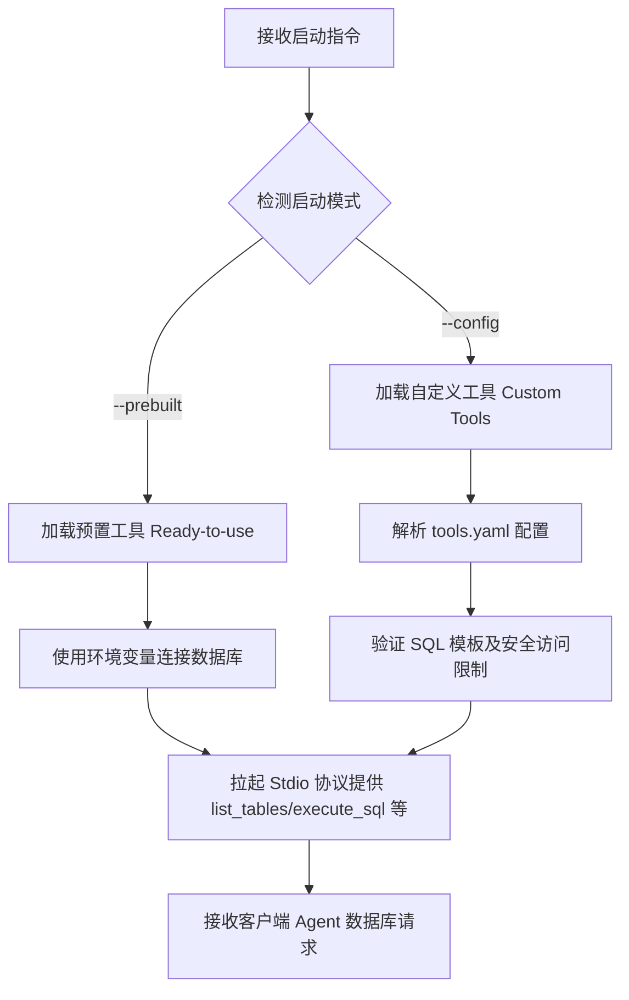

<div align="center">


# MCP Toolbox for Databases (数据库 MCP 工具箱)

<p align="center">
  
  
  
</p>

</div>

MCP Toolbox for Databases 是一个开源的 Model Context Protocol (MCP) 服务器，旨在将您的 AI 智能体、IDE 和应用程序直接连接到企业级数据库（如 PostgreSQL, MySQL, BigQuery, Spanner 等）。

它提供以下**双重核心定位**：
1. **开箱即用的预置工具 (Build-Time)：** 快速将 AI 智能体连接至数据库，利用预置的通用工具执行查询、查看 Schema 并生成代码，免去编写样板代码的繁琐。
2. **自定义工具框架 (Run-Time)：** 为生产环境构建具备极高安全约束的定制化 AI 数据库工具，支持结构化查询、语义检索以及防 SQL 注入的安全 NL2SQL。

---

## 🛠️ 第一阶段：环境自检与首次初始化引导

在配置和启动 MCP Toolbox 数据库服务前，AI 代理或开发人员应按照以下指引进行环境诊断和自愈。

### 1. 运行依赖与自检命令

MCP Toolbox 支持多种启动方式。在终端中，请执行以下命令检查本地运行依赖的就绪情况：

```powershell
# 1. 检查本地 Go 开发环境 (若需要从源码编译)
go version

# 2. 检查本地 Node.js 与 npm 环境 (若需要使用 npx 快速无感拉起)
node -v; npm -v

# 3. 检查 Docker 容器环境 (若需要使用容器化隔离部署)
docker --version
```

### 2. 缺失依赖的自愈与安装

针对不同的启动偏好，如果自检显示依赖缺失，请参考以下指引进行自动修复或手动安装：

| 启动偏好 | 所需依赖 | 缺失时的修复与安装方法 |
| :--- | :--- | :--- |
| **Go 源码编译** | Go 1.22+ 运行环境 | 引导用户去 [Go 官网](https://go.dev/) 下载安装包并配置环境变量。在工具目录执行 `go mod download` 下载全部依赖。 |
| **npx 免安装启动** | Node.js 18+ & npm | 通过 npx 启动时，系统会自动下载 `@toolbox-sdk/server` 包并运行，请确保本地已配置 Node.js 基础环境。 |
| **Docker 容器** | Docker Desktop / Daemon | 引导用户去官方下载安装 Docker。在缺失镜像时，可执行以下命令进行自愈：<br>`docker pull gcr.io/gcp-elcarro/mcp-toolbox:latest` |

### 3. 首次使用凭证与自愈配置

MCP Toolbox 连接目标数据库需要正确配置数据库凭证。我们可以通过设置环境变量或使用 `tools.yaml` 配置文件来进行首次自愈连接。

#### 🔑 核心连接环境变量自检：
请在运行服务前，根据数据库类型配置相应的环境变量：

* **PostgreSQL / AlloyDB / CockroachDB**：
  - `POSTGRES_HOST` / `POSTGRES_PORT`（默认 5432）
  - `POSTGRES_DB` / `POSTGRES_USER` / `POSTGRES_PASSWORD`
* **MySQL / MariaDB**：
  - `MYSQL_HOST` / `MYSQL_PORT`（默认 3306）
  - `MYSQL_DATABASE` / `MYSQL_USER` / `MYSQL_PASSWORD`
* **SQL Server (MSSQL)**：
  - `MSSQL_HOST` / `MSSQL_PORT`（默认 1433）
  - `MSSQL_DATABASE` / `MSSQL_USER` / `MSSQL_PASSWORD`
* **Oracle Database**：
  - `ORACLE_HOST` / `ORACLE_PORT` / `ORACLE_SERVICE` / `ORACLE_USER` / `ORACLE_PASSWORD`
* **Google Cloud Databases (AlloyDB, BigQuery, Spanner, Firestore 等)**：
  - 配置 `GOOGLE_APPLICATION_CREDENTIALS` 环境变量，使其指向合法的 GCP 服务账号 JSON 凭证文件。

---

## 🚀 第二阶段：核心执行工作流

环境自检与凭证就绪后，开发人员可以开始运行 MCP Toolbox 服务。

### 1. 核心工作流与模式分流

MCP Toolbox 提供了两种核心工作流：



- **Ready-to-use 模式 (预置通用工具)**：
  - 用于开发及调试阶段。系统会为 Agent 提供通用数据库元数据及标准 SQL 执行能力（例如 `list_tables`、`execute_sql`）。
- **Custom Tools 模式 (受限制的自定义工具)**：
  - 用于生成生产环境。在该模式下，Agent 仅允许执行您在 `tools.yaml` 中定义的 SQL 查询模板，能有效阻断非法删库、防范 SQL 注入，安全性极高。

### 2. 命令行使用手册

您可以直接在客户端的 MCP 配置文件（例如 `mcp.json` 或 `claude_desktop_config.json`）中按需添加配置。

#### 配置示例 A：使用 npx 拉起 PostgreSQL 预置工具

```json
{
  "mcpServers": {
    "toolbox-postgres": {
      "command": "npx",
      "args": [
        "-y",
        "@toolbox-sdk/server",
        "--prebuilt=postgres",
        "--stdio"
      ],
      "env": {
        "POSTGRES_HOST": "127.0.0.1",
        "POSTGRES_PORT": "5432",
        "POSTGRES_DB": "my_database",
        "POSTGRES_USER": "my_user",
        "POSTGRES_PASSWORD": "my_password"
      }
    }
  }
}
```

#### 配置示例 B：使用本地编译的 Go 二进制文件拉起服务

首先在工具目录下执行编译：
```powershell
go build -o mcp-toolbox main.go
```

随后在您的 MCP 配置文件中加载：
```json
{
  "mcpServers": {
    "toolbox-custom": {
      "command": "D:/GoogleAI/github/ai-tools/tools/mcp-toolbox/mcp-toolbox.exe",
      "args": [
        "--config",
        "D:/GoogleAI/github/ai-tools/tools/mcp-toolbox/tools.yaml",
        "--stdio"
      ]
    }
  }
}
```

#### 📝 `tools.yaml` 自定义工具语法格式：

```yaml
# 1. 定义数据源
kind: source
name: my-pg-source
type: postgres
host: 127.0.0.1
port: 5432
database: toolbox_db
user: toolbox_user
password: my-password

---
# 2. 定义受限执行工具
kind: tool
name: get-active-users
description: 获取活跃用户列表
source: my-pg-source
sql: |
  SELECT id, username, email FROM users WHERE status = 'active' LIMIT :limit
parameters:
  properties:
    limit:
      type: integer
      description: 最大返回条数
      default: 10
```

### 3. 工具卸载方法

如果您希望从系统及主收藏仓库中安全地移除 MCP Toolbox，请执行以下步骤：
1. 物理删除个人收藏仓库中的子目录：`tools/mcp-toolbox/`。
2. 物理清理全局 npm 缓存（如曾下载过此包）：在终端运行 `npm cache clean --force`。
