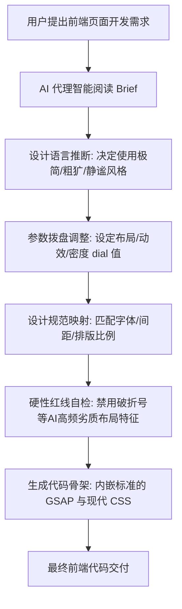

# taste-skill - AI 智能体的前端审美与反模板化设计技能框架

本工具（Taste Skill）是一个专为 AI 编码智能体设计的前端美学与设计原则框架。它能够纠正 AI 自动生成的千篇一律、具有廉价感的界面（即 AI 味/模板化前端），通过精细的排版、创新的布局、流畅的微动效以及合理的间距，赋予 AI 产出高水准、具有现代美感和高级视觉表现力界面的能力。

本框架支持与 React、Vue、Svelte 等主流前端框架无缝配合。

---

## 🛠️ 第一阶段：环境自检与首次初始化引导

为了确保本框架的各个美学技能可以被 AI 智能体顺利加载和解析，请按照以下步骤进行环境自检和个性化配置。

### 1. 系统要求与环境自检

*   **基础运行环境**：需要本地安装有 **Node.js** 和 **npm/npx**。
*   **安装前自检**：在安装前，可以通过以下命令检查当前系统的 npx 可用性：
    ```bash
    npx --version
    ```
*   **环境缺失自愈**：如果系统未安装 Node.js，AI 智能体将引导您前往 Node.js 官网进行安装；如果检测到您的 AI 客户端缺少运行特定图像生成或转换脚本的依赖，请允许 AI 智能体执行自动依赖补全。

### 2. 本地安装与引入说明

本框架下包含的多个微技能均可通过官方的 [Agent Skills](https://github.com/vercel-labs/agent-skills) 命令行工具统一安装。

*   **一键全局安装**（推荐，使您的 AI 智能体在所有项目中均可调用该设计品味技能）：
    ```bash
    npx skills add https://github.com/Leonxlnx/taste-skill -g
    ```
*   **按需安装单一特定技能**：
    如果仅需要使用特定的“核心美学技能 v2 版本”，可以使用 `--skill` 参数指定安装名：
    ```bash
    npx skills add https://github.com/Leonxlnx/taste-skill --skill "design-taste-frontend"
    ```

### 3. 设计偏好拨盘参数 (Settings & Dials)

在核心技能文件的顶部，提供有三个可调节的数值偏好拨盘（范围为 1 至 10）。用户或 AI 代理可以根据当前项目的视觉调性，直接在技能文件中或通过环境变量调整这些 dial 数值：

1.  **DESIGN_VARIANCE（布局多样度 1-10）**：
    *   *低数值（如 1-3）*：倾向于对称、规整、经典的经典对齐布局。
    *   *高数值（如 8-10）*：鼓励 AI 探索不对称、前卫、现代网格的艺术化排版。
2.  **MOTION_INTENSITY（动效强度 1-10）**：
    *   *低数值（如 1-3）*：仅启用基础的悬停（Hover）微交互。
    *   *高数值（如 8-10）*：全面激活基于 GSAP 的滚动视差、磁性吸附等深度交互动效。
3.  **VISUAL_DENSITY（信息密度 1-10）**：
    *   *低数值（如 1-3）*：极其开阔的大留白设计。
    *   *高数值（如 8-10）*：紧凑的数据看板与密集信息布局。

---

## 🚀 第二阶段：核心执行工作流

本框架的运行策略是“设计先行，规则内嵌”，由 AI 在编码前进行设计语言推断，随后按照严格的美学骨架生成代码。

### 1. 路由机制与功能优先级

当您向支持该技能的 AI 智能体发出需求时，AI 代理内部将按照以下工作流路由并执行：



1.  **需求分析与设计推断**：AI 代理首先会推断页面的视觉定位。
2.  **映射设计系统**：定义具体的 CSS 变量系统，确立现代无衬线字体层级和流畅的间距缩放律。
3.  **防重复与降噪规则过滤**：严禁 AI 生成毫无变化的重复卡片与干瘪的排版，强行剔除无意义的装饰。
4.  **动效与骨架装配**：基于 GSAP 加载动画骨架，确保动画顺滑有弹性。
5.  **交付前预检**：进行设计合规性自检，完成交付。

### 2. 常用技能与命令手册

本框架提供了多个针对特定交互场景的子技能，您可以在命令行中直接选择安装：

| 子技能文件夹名 | 技能安装名称 (传入 --skill) | 核心功能简述（中文） | 适用场景 |
| :--- | :--- | :--- | :--- |
| **taste-skill** | `design-taste-frontend` | 🆕 **v2 实验版（默认）**：支持自适应设计推断，包含 GSAP 动效骨架、重构审计协议，并允许通过三个偏好数值拨盘进行定制 | 通用的高品质网页与交互界面开发 |
| **taste-skill-v1** | `design-taste-frontend-v1` | 保持 v1 版本的稳定版设计规则，规避 v2 的部分实验性改动 | 原有项目的兼容性维护 |
| **gpt-tasteskill** | `gpt-taste` | 针对 GPT 与 Codex 优化的严格美学提示，防范生成平庸的前端结构 | 使用 Cursor/ChatGPT 进行网页开发 |
| **image-to-code-skill** | `image-to-code` | 图片优先工作流：引导 AI 先生成网站视觉图，分析结构后实现对应前端 | 拥有原型图或需要生成视觉参考的网页开发 |
| **redesign-skill** | `redesign-existing-projects` | 遗留项目重构：先对现有 UI 进行排版审计，再重构布局和层级 | 针对既有项目的视觉翻新与净化 |
| **soft-skill** | `high-end-visual-design` | 专为“昂贵、沉静”的高奢视觉定制的平滑高雅风格原则，低对比度大留白 | 高端品牌展示页、高水准视觉官网 |
| **minimalist-skill** | `minimalist-ui` | Notion/Linear 风格的编辑产品与工具界面，克制配色，结构洗练 | 效率工具、文档编辑器、开发者工具 |
| **brutalist-skill** | `industrial-brutalist-ui` | 工业粗野主义与瑞士排版风格：高对比度、实验性布局、硬朗机械线条 | 艺术项目、潮流品牌、前卫概念页面 |
| **output-skill** | `full-output-enforcement` | 强制模型输出完整代码，禁止使用任何省略号或占位符注释 | 解决 AI 在代码过长时自动截断或偷懒的问题 |

#### 🎨 视觉图像辅助生成技能 (无代码输出，生成设计图参考)
如果您需要为编写代码的智能体提供直观的视觉参考，可以先安装并调用以下图像生成提示词技能：
*   **imagegen-frontend-web** (`imagegen-frontend-web`)：生成排版精美、留白合理的精美桌面端网页原型设计。
*   **imagegen-frontend-mobile** (`imagegen-frontend-mobile`)：生成 iOS/Android 移动端多屏设计原型。
*   **brandkit** (`brandkit`)：生成包含标志方向、配色、字体的品牌设计图册。

### 3. 卸载方法

如果您希望从本地系统中卸载该框架的技能，可以在终端中运行：
```bash
npx skills remove taste-skill -g
```
这将彻底清除全局缓存中注册的该技能及其对应指令。
