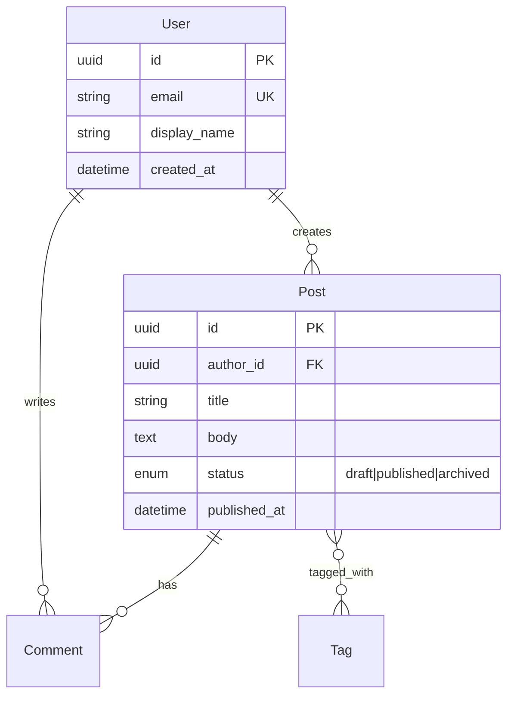

# 数据库设计规范(vibe-architecture reference)

> 本文件被 `SKILL.md` 的「数据库设计方法论」与 `architecture.md` 第 3 章「数据库设计」引用,是其细节背书。

数据库基于 **CloudBase 数据库**,**二选一**(在 `architecture.md` 项目级决策已定):**路径 A:PostgreSQL 关系型** 或 **路径 B:文档型**。数据模型**照 `interaction.md` 的数据需求派生**——`interaction.md` 已先于 `architecture.md` 存在,逐页写明要展示什么数据(读)、点击写什么(写),据此反推需要哪些实体/集合与字段。无论哪种,**行级安全规则(security rules)是权限的第一道防线**——凡 SDK 直连能触达的数据,都必须由 security rules 兜底,不能假设「前端不调就安全」。两条路径的字段表都统一保留「**对应 interaction.md 展示位**」列,每个可见字段回指它服务于 `interaction.md` 的哪个页面/元素,作为「照 interaction 派生」与 architecture ↔ interaction 对齐的关键。

> **字段类型化铁律(两条路径通用)**:每个字段的「类型」必须可**直接映射到 TS 类型**(`string` / `number` / `boolean` / 枚举联合 / 嵌套对象 / 数组),**显式标可空、枚举逐一列取值、嵌套对象逐层展开**;每个**可见字段**必须能对应到某个接口的②响应 DTO 字段(见 `references/api.md`),反之每个响应 DTO 可见字段也能在此找到来源字段。**库字段类型 ↔ 接口 DTO 类型 ↔ 前端 view-model 类型三者一致**,杜绝漂移。

## 路径 A:PostgreSQL 关系型(强关系 / 事务)

### A.1 实体关系(ERD)

用 mermaid `erDiagram` 表达,实体名 PascalCase,关系标注基数(`||--o{` 等):

### A.2 表结构字段规范

每张表用统一表格描述,列固定为:`字段 | 类型 | 约束 | 默认值 | 说明 | 对应 interaction.md 展示位`。最后一列是对齐关键——若某字段「无任何页面展示且无业务逻辑使用」,需在说明里写明用途(审计、软删除等),否则视为冗余字段需删除。示例:

| 字段 | 类型 | 约束 | 默认值 | 说明 | 对应 interaction.md 展示位 |
|------|------|------|--------|------|----------------------------|
| id | uuid | PK | gen UUID v7 | 主键 | — |
| author_id | uuid | FK→users.id NOT NULL | — | 作者 | post-detail-E-A-02 作者名 |
| title | varchar(120) | NOT NULL | — | 标题 | post-detail-E-A-01 标题 |
| status | varchar | CHECK in(draft,published,archived) | 'draft' | 状态枚举 | post-list-E-A-04 状态徽标 |
| created_at | timestamptz | NOT NULL | now() | 审计创建时间 | — (审计) |
| deleted_at | timestamptz | NULL | — | 软删除标记 | — (软删) |

**强制字段规约:**
- **主键** 统一 `id`,默认 **UUID v7**(有序、避免热点)或自增 `bigint`(单库高写入),在 `architecture.md` 说明取舍依据。
- **审计字段** 每张业务表必须含 `created_at`、`updated_at`;需软删除的表加 `deleted_at`(可空)。
- **命名** 表名 snake_case 复数(`posts`),字段 snake_case;布尔字段以 `is_/has_` 前缀;**金额用 `decimal` 不用 `float`**;时间统一 `timestamptz` 存 UTC。
- **枚举** 用受约束的 string,在字段说明里列出全部取值。
- **JSON 字段** 仅用于「无需独立查询/索引」的弱结构数据,需注明 schema。

### A.3 索引

表格列出 `索引名 | 表 | 字段(顺序) | 类型(B-tree/GIN/唯一/复合) | 服务于哪个查询/接口`:

| 索引名 | 表 | 字段(顺序) | 类型 | 服务于哪个查询/接口 |
|--------|----|-------------|----|----------------------|
| idx_posts_author | posts | (author_id) | B-tree | `API-POST-LIST` 按作者过滤 |
| uq_users_email | users | (email) | 唯一 | 登录/注册唯一性校验 |

**规则**:外键列默认建索引;高频过滤/排序字段建索引;唯一业务键建唯一索引;**每个索引必须能指向一个具体接口**的 WHERE/ORDER BY,否则不建。

### A.4 关系与完整性

- 明确每个外键的级联策略(`ON DELETE CASCADE / SET NULL / RESTRICT`)及业务理由。
- 多对多关系显式定义**中间表**(含自身审计字段)。
- 约束分层:说明哪些约束在**数据库层**、哪些在 **security rules**、哪些在**应用层**保证。

## 路径 B:文档型(灵活 / 快速迭代)

### B.1 集合与文档结构

以集合(collection)为单位,逐集合给出文档结构表:`字段 | 类型 | 必填 | 说明 | 对应 interaction.md 展示位`;嵌套对象/数组需展开到可实现颗粒度,标明每层 schema。示例:

| 字段 | 类型 | 必填 | 说明 | 对应 interaction.md 展示位 |
|------|------|------|------|----------------------------|
| _id | string | 是 | 文档主键 | — |
| title | string | 是 | 标题 | post-detail-E-A-01 标题 |
| author | object{id,name} | 是 | 内嵌作者(冗余) | post-detail-E-A-02 作者名 |
| _ver | number | 是 | 文档版本字段(兼容读) | — (迁移用) |

### B.2 内嵌 vs 引用决策

| 取舍 | 选择 |
|------|------|
| 读多 / 聚合强(常一起读出) | **内嵌(embed)** |
| 独立查询 / 复用强(被多处引用) | **引用(reference)+ 冗余键** |

### B.3 索引

表格列出 `索引名 | 集合 | 字段(顺序) | 类型(单字段/复合/唯一) | 服务于哪个查询/接口`;规则同关系型——高频过滤/排序/唯一业务键建索引,每个索引指向具体接口。

## 行级安全规则(security rules)编写范式

- **每个表 / 集合都必须显式声明 security rules**:谁能读、谁能写、写时校验哪些字段。
- 范例「只能改自己的记录」:`auth.uid == resource.owner_id`。
- 凡允许 **SDK 直连**的数据,security rules 必须是充分约束;**敏感写入**(扣款、改状态、改他人数据)即便有 rules,也应收口到云函数。
- security rules 与接口契约的鉴权要求、interaction.md 的门控矩阵(功能化条件:401 未登录 / 403 无权限…)三者必须一致;因 `interaction.md` 已先存在,第 8 章对齐矩阵对其**每条数据的 security rules 确定式全覆盖**、逐条可追溯无缺口。

**读写权限模板:**

| 操作 | 规则表达式 | 说明 |
|------|------------|------|
| 读 read | `auth != null` 或 `resource.visibility == 'public'` | 登录可读 / 公开可读 |
| 写 create | `auth != null && request.owner_id == auth.uid` | 只能以自己身份创建 |
| 写 update | `auth.uid == resource.owner_id` | 只能改自己的记录 |
| 写 delete | `auth.uid == resource.owner_id || auth.role == 'admin'` | 本人或管理员可删 |

## 迁移 / 演进策略

- **关系型**:迁移文件**版本化入库**、**单向前进可回滚**、**禁止手改生产库**;破坏性变更(删列/改类型)采用「**扩展-迁移-收缩(expand-migrate-contract)**」三步,保证发布期间新旧代码兼容。
- **文档型**:无强 schema,但需维护「**文档版本字段 `_ver` + 兼容读**」策略,记录字段演进;迁移脚本独立版本化。
- **种子数据(seed)**:区分「基础字典数据」(随迁移)与「演示数据」(独立脚本)。
- **安全网**:CloudBase 数据库的备份恢复能力作为发布前的安全网。
