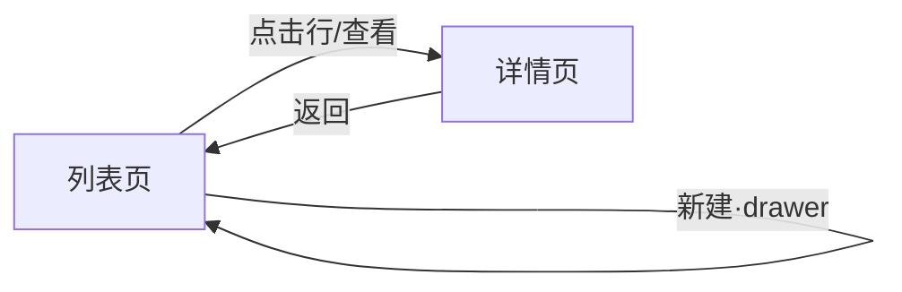
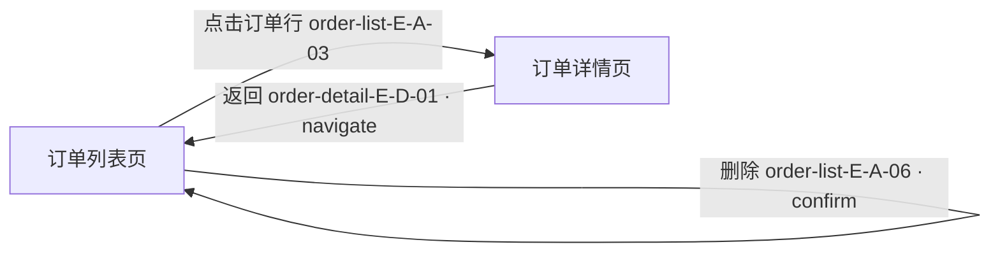

# vibe-interaction — 超详细交互文档

> 整套 Vibe Coding skill 的**差异化灵魂**:把「用户在每个页面、每次点击会看到与触发什么」写到零歧义颗粒度。
> SKILL.md 正文承载**方法论、模板与对齐规则**;详尽词表/字段规范/专业范式下沉到 `references/`,正文用「详见 references/<file>.md」指向。

## 定位

- **流水线第二环**:产物主线 `idea.md → interaction.md → architecture.md → design.md(视觉) → prototypes/ → 代码` 中的第二环。**输入** = `idea.md`(由 `vibe-idea` 产出);**输出** = `interaction.md`(交互骨架,**第一份 UI 文档**),固定名、与 `idea.md` 同目录(项目根)。
- **类型 = 新写(独立方法论)**:本 skill 不薄封装任何 superpowers skill,自带一套「呈现方式分类法 + 逐元素交互规格」方法论。
- **职责边界**:本 skill **不碰**技术栈 / 数据库 / 接口定义(那是 `vibe-architecture` 的职责,它会照本文件的数据需求派生),也**不碰**视觉设计准则 / 设计 token / 配色排版(那是 `vibe-design` 的职责)。它只负责把每个页面的**布局、功能模块、页面逻辑、跳转逻辑、每个按钮/元素点击后的逻辑、弹窗逻辑**(明确标注 弹窗 `modal` / 跳转 `navigate` / 浮窗 `popover` / 抽屉 `drawer` / 轻提示 `toast` 等)写到「任何实现者读完都能零歧义复现」的程度。
- **第一份 UI 文档**:`interaction.md` 是流水线里**首次定义 页面ID / 模块ID / 元素ID** 的文档(下游 `architecture.md` 之后引用它们)。它描述「用户在每个页面、每次点击看到与触发什么」,并**功能化描述每页的数据需求**(这页要展示什么数据=读、这次点击写什么=写),**不写接口 ID**(`architecture.md` 此时尚不存在,接口 ID 由其随后据此派生)。细化中若发现产品层缺口,**回填上游 `idea.md`**(沿用「以上游为权威主线」的回填裁决原则;见下文「完成判定」第 5 条)。它是整条主线里「最易遗漏、用户最看重」的一环,也是本套件相对通用 AI 编程的差异化核心。
- **下游交接**:`interaction.md` 就绪后交给 `vibe-architecture`,它将**照本文件的数据需求派生** `architecture.md`(数据模型 / 接口 / 安全规则,并定义接口 ID),其后再由 `vibe-design`(视觉)产出 `design.md`、`vibe-prototype` 依 `design.md`(视觉权威)+ `interaction.md`(元素/状态)出原型(顺序:idea 1 → interaction 2 → architecture 3 → design 视觉 4 → prototype 5)。

## 何时触发 / 何时不触发

**正向触发**:用户已有 `idea.md`,想把页面与元素的交互行为定义到可实现颗粒度——谈「设计交互 / 交互文档 / 页面逻辑 / 跳转逻辑 / 点了怎么跳 / 是弹窗还是跳转 / 弹窗还是新页面 / 把页面流程理清楚 / 每个按钮 / 每个元素 / interaction」。

**反触发(相邻阶段抢入口时主动让路)**:

1. **还在澄清产品想法 / 没有 `idea.md`**(产品意图尚未定型)→ 交给 `vibe-idea`;连产品想法都未收敛,更谈不上逐页逐元素交互。
2. **已有 `interaction.md` 要据其派生技术骨架 / 数据模型 / 接口(`architecture.md`)** → 交给 `vibe-architecture`;`architecture.md` 是本文件的**下游**,它照本文件功能化描述的数据需求派生数据模型与接口、并定义接口 ID。
3. **已有 `architecture.md` 要做视觉设计准则 / 设计系统 / `design.md`(tokens、配色、排版、组件、Do&Don't)** → 交给 `vibe-design`(视觉)。
4. **已有 `design.md`(视觉)与 `interaction.md` 要画原型 / 出设计图 / 接 Stitch** → 交给 `vibe-prototype`。
5. **要写代码 / 修 bug / 跑测试** → 交给 `vibe-implement`。

## 文件总则(强制约定)

撰写 `interaction.md` 必须逐条遵守以下五条:

1. **文件位置**:与 `idea.md` 同目录(项目根),命名固定为 `interaction.md`,不得改名。
2. **对齐回指**:文件头部必须声明「本文档对齐 `idea.md` 的哪个版本/commit」(上游产品立项);每个页面的「数据需求」字段必须**功能化描述读什么 / 写什么**(如「展示订单列表=读」「点击删除=写一次订单删除」),**不写接口 ID**——接口 ID 由下游 `architecture.md` 据此派生定义,本文件**不得在此另起接口定义、也不引用尚不存在的接口 ID**。
3. **ID 规范**:本文件是流水线里**首次定义** 页面ID / 模块ID / 元素ID 的文档(下游 `architecture.md` 之后引用它们)。沿用贯穿全流水线的全局 ID 规范——页面 ID = 可读 kebab-case slug、模块 ID `<页面ID>-M-<字母>`、元素 ID `<页面ID>-E-<字母>-<序号>`;接口 ID `API-<域>-<动作>` 由下游 `architecture.md` 据本文件数据需求**派生定义**,本文件不出现。其中元素 ID 的 `<字母>` 是**整页元素分组的序列字母,不必与模块字母一致**(同一页面下不同模块的元素可共用一套 A/B/C… 字母序列,只要全页元素 ID 唯一即可;如下文示例里筛选栏 `order-list-M-A` 与订单表格 `order-list-M-B` 下的元素都用 `E-A-*` 系列)。**全文件 ID 唯一**;跳转关系、入口出口、门控矩阵、对齐互指一律用 ID。
4. **零占位**:不得出现占位禁词(原样为 `T​BD`、`待​定`、`具体见​后续`,以及其他英文待办词等拖延话术)或空表格;任何分支(成功 / 失败 / 空 / 无权限)都必须写出明确行为。
5. **呈现方式强制标注**:凡「行为」涉及视觉层级变化的,**必须用下文「呈现方式分类法 Taxonomy」的关键字之一标注**(`navigate`/`modal`/`confirm`/`drawer`/`popover`/`bottomsheet`/`toast`/`inline-expand`/`inline-edit`/`newtab`/`download`),违者视为规格不合格。

## references 导航

正文留方法论与模板,细节下沉 references:

- **完整呈现方式词表 + shadcn 组件映射 + 决策规则** —— 详见 `references/interaction-taxonomy.md`。
- **无障碍 a11y(WCAG 2.1 AA 专业规范、逐 taxonomy 要点、标注模板)** —— 详见 `references/a11y.md`。
- **状态体系化(状态机)+ 微交互动效基线** —— 详见 `references/states-and-motion.md`。
- **Generative UI 交互范式(AI / 对话 / agent 产品)** —— 详见 `references/generative-ui.md`。

## 模板

`interaction.md` 由三套可直接复制的模板拼成:**A. 全局信息架构**(全文件一份)、**B. 单页面规格**(每个页面重复一份)、**C. 功能模块 / 区块规格**(每个模块一份)。下列骨架中的 `<page-slug>` / `<page-slug>-M-A` / `<page-slug>-E-A-01` 是**模板占位**(写真实页面时替换为真实 ID),不属于内容占位。

### 模板 A · 全局信息架构(Global Information Architecture)

全文件唯一一份,声明站点地图、导航、跳转关系图、全局组件、全局状态,以及全局 a11y / 动效基线。

````markdown
# 交互文档 interaction.md

> 对齐:idea.md @ <版本号/commit>
> 角色定义(贯穿全文):<访客 guest> / <普通用户 user> / <管理员 admin> / ...

## A. 全局信息架构

### A.1 站点地图 / 页面清单
| 页面ID | 页面名称 | 路由 | 所属域 | 默认可见角色 |
|--------|----------|------|--------|--------------|
| <page-slug> | <名称> | /path | <域> | <角色列表> |

### A.2 导航结构
- **顶部导航(Top Nav)**:<是否存在;包含项与各自指向的页面ID;是否随登录态变化>
- **侧边导航(Side Nav)**:<是否存在;层级;折叠规则;高亮当前页规则>
- **底部导航(Bottom Tab,移动端)**:<是否存在;Tab 项与指向页面ID>
- **面包屑(Breadcrumb)**:<规则>

### A.3 页面跳转关系图

> 注:drawer/modal 不产生路由跳转的,在图中以**自环 + 标注 "(drawer)/(modal)"** 表示,不画成新节点。

### A.4 全局组件(挂载于根布局,所有页面共享)
| 组件 | 类型 | 说明 | 触发来源 |
|------|------|------|----------|
| 全局导航栏 | Top Nav | 见 A.2 | 常驻 |
| 全局弹窗容器 | modal root | 承载所有 modal/二次确认 | 任意页面调用 |
| 全局抽屉容器 | drawer root | 承载所有 drawer | 任意页面调用 |
| 全局 Toast 容器 | toast root | 右上/顶部居中,**堆叠上限 3,默认 3s 自动消失** | 任意页面调用 |
| 全局 Loading 遮罩 | overlay | 仅用于阻断式全局操作 | 显式调用 |
| 会话过期拦截器 | modal | **401 时统一弹出"重新登录" modal** | 全局接口拦截 |

### A.5 全局状态(Global State)
| 状态 | 取值 | 影响范围 | 变更触发 |
|------|------|----------|----------|
| 登录态 isAuthed | true/false | 导航项可见性、受保护页面准入 | 登录/登出/401 |
| 当前角色 role | guest/user/admin | 元素级门控(见 §F) | 登录成功后写入 |
| 主题 theme | light/dark | 全局配色 | 用户切换/系统跟随 |
| 全局加载 globalLoading | true/false | Loading 遮罩 | 阻断式操作 |

### A.6 全局 a11y 基线(一处声明,各页继承,逐元素只标差异 —— 详见 references/a11y.md)
- **跳转链接 skip-to-content**:页首提供「跳到主内容」隐藏链接,键盘第一个 Tab 可达。
- **`lang` 属性**:根 `<html lang="zh-CN">`,多语言页随切换更新。
- **全局 focus-visible ring token**:沿用 **shadcn 组件变体体系(套件铁律基线)** 的 `focus-visible:ring-2 focus-visible:ring-ring`(Next.js+CloudBase+shadcn 固定基线,不依赖 `architecture.md` 已写),禁止 `outline:none` 而无替代。
- **最小对比度与触控目标规约**:正文对比度 ≥ 4.5:1、大字/图形/状态色 ≥ 3:1;触控目标 ≥ 44×44px。
- **读屏宣告策略**:`toast` 用 `aria-live="polite"`;路由切换后焦点移到新页主区/标题供读屏宣告页面变更。

### A.7 动效 token 基线(登记四类时长/缓动 token + 全局 reduced-motion 策略 —— 详见 references/states-and-motion.md)
| 动效类型 | 默认时长 | 缓动 | 典型用途 |
|---|---|---|---|
| enter(进场) | 150–200ms | ease-out | modal/drawer/popover 出现 |
| exit(退场) | 100–150ms | ease-in | 浮层关闭(略快于进场) |
| move(位移/重排) | 200–300ms | ease-in-out | 列表重排、inline-expand 展开 |
| feedback(反馈) | ≤100ms | ease-out | 按下、hover、开关切换 |
> 全局策略:token 单一来源在 **shadcn 组件变体体系(套件铁律基线)** 的 theme / CSS variables;`@media (prefers-reduced-motion: reduce)` 下位移/缩放降级为瞬时切换或极短 opacity 渐隐,关键状态变更保留、纯装饰关闭。逐元素只标「用哪档 + 回退」。
````

### 模板 B · 单页面规格(Per-Page Spec)—— 每个页面重复一份

````markdown
## <page-slug> <页面名称>

| 字段 | 内容 |
|------|------|
| 页面ID | <page-slug> |
| 路由 | /path/:id |
| 目的(一句话) | <用户在此页要完成什么> |
| 入口(从何而来) | 列出 来源页面ID + 触发元素ID(如 从 <other-slug> 的 <other-slug>-E-A-03 点击进入) |
| 出口(去往何处) | 列出 目标页面ID + 触发元素ID;含"返回"行为 |
| 设备/断点 | desktop / tablet / mobile 三档差异(若有) |

### 布局分区(Layout Regions)
- **Header**:<内容与高度行为>
- **Sidebar**:<内容;是否可折叠>
- **Main**:<主区域,通常承载核心模块>
- **Footer**:<内容;是否吸底>

### 所含功能模块
- <page-slug>-M-A <模块名>(见 §C)
- <page-slug>-M-B <模块名>

### 页面级状态 —— 状态矩阵(四态为必填底线,扩展态按数据生命周期补)
> `loading / empty / error / forbidden` 四态**必填**(空表格不通过);`partial / offline / stale / optimistic` 等扩展态**按本页数据生命周期补**。错误态用**功能化条件**描述(网络超时 / 401 未登录 / 403 无权限 / 5xx 致命 / 返回空集…),**由下游 `architecture.md` 据此定义错误码**;本文件不写错误码。

| 状态 | 触发条件(功能化) | 呈现(绑定下文「呈现方式分类法 Taxonomy」/ shadcn) | 可恢复性分级 |
|------|----------|-------------------------------------|--------------|
| 加载中 loading | 进入页/数据请求中(结构已知) | 骨架屏 Skeleton,指明范围 | — |
| 空 empty | 数据返回空集 | 空状态插画 + 文案 + 主行动按钮ID | — |
| 错误 error · 可重试 | 网络/超时 | 错误占位 + "重试"按钮,点击重新请求 | 可重试 |
| 错误 error · 需登录 | 401 未登录 / 会话过期 | 会话过期 modal 或 navigate 登录(沿用 A.4 拦截器) | 需登录 |
| 错误 error · 致命 | 5xx 服务端致命 / 数据损坏 | 错误占位 + 反馈入口,不提供"重试" | 致命 |
| 无权限 forbidden | 403 无权限 / 角色不满足 | 403 占位 / 重定向到 <other-slug>(二选一并写明) | 需提权 |
| 部分加载 partial | 分页/分块到达 | 已到区块渲染 + 剩余 Skeleton / "加载更多"按钮 | — |
| 离线 offline | 断网 | 全局/局部离线条;写操作禁用并 toast 提示 | — |
| 旧数据 stale | 缓存有效、后台刷新 | 直接展示旧数据 + 极轻"更新中"指示 | — |
| 乐观更新 optimistic | 写操作发起 | 就地预渲染结果 + loading 小态;失败回滚 + toast"已撤销" | 可重试 |

### 数据需求(读/写,供 architecture 派生)
> 功能化描述这页**读什么 / 写什么**,不写接口 ID;下游 `architecture.md` 据此派生数据模型与接口、并定义接口 ID 回标到这些数据需求。

| 数据需求描述(读什么/写什么) | 时机 | 失败回退 |
|------|------|----------|
| <读:展示什么数据 / 写:这次动作写什么> | 进入页加载 | 进入 error 态 |
````

### 模板 C · 功能模块 / 区块规格

> 每个独立取数的数据块,**追加一张块级状态矩阵**(列:`状态 | 触发(功能化) | 呈现 | 可恢复性分级`),口径同模板 B 的状态矩阵;触发用功能化条件描述、不写错误码(由 architecture 据此定义);无独立取数的纯展示块可省略。

````markdown
### <page-slug>-M-A <模块名>
- **用途**:<这个区块解决什么>
- **位置**:<在哪个布局分区>
- **元素清单**:
  | 元素ID | 元素名 | 类型 |
  |--------|--------|------|
  | <page-slug>-E-A-01 | 新建按钮 | button |
  | <page-slug>-E-A-02 | 搜索框 | input |
  | <page-slug>-E-A-03 | 数据行 | row/card |
- **块级状态矩阵**(仅当本模块独立取数时):
  | 状态 | 触发(功能化) | 呈现 | 可恢复性分级 |
  |------|------|------|--------------|
  | loading | 模块取数中 | 区块 Skeleton | — |
  | empty | 数据返回空集 | 区块空插画 + 文案 | — |
  | error | 取数失败(网络/超时) | 区块错误占位 + 重试 | 可重试 |
````

## 呈现方式分类法 Taxonomy(全文件强制词表)

每个「行为」在改变视觉层级时,**必须且只能**标注下列 11 个关键字之一。下面给出**关键字清单 + 一句话语义**作为正文速查;每个关键字的「是否改变路由 / 是否阻断」等完整四列定义、shadcn 映射与决策规则的**单一事实源**在 `references/interaction-taxonomy.md`,正文与之冲突时以 reference 为准。

- `navigate` —— 页面跳转:进入新页面/路由,产生历史记录、可后退(整页替换)。
- `modal` —— 模态弹窗:居中浮层 + 遮罩,需用户处理后关闭(遮罩阻断)。
- `confirm` —— 二次确认弹窗:`modal` 的特例,仅"确认/取消"两按钮,用于危险操作(阻断)。
- `drawer` —— 抽屉:从边缘(右/左/上/下)滑入的面板,保留上下文(半阻断,可带遮罩)。
- `popover` —— 浮层气泡:锚定在触发元素旁的小浮层,点外部即关(不阻断)。
- `bottomsheet` —— 底部动作条:移动端从底部升起的动作面板(半阻断)。
- `toast` —— 轻提示/snackbar:短暂非阻断反馈,自动消失,不打断操作(不阻断)。
- `inline-expand` —— 原地展开/手风琴:在当前位置展开更多内容(折叠面板/嵌套行,不阻断)。
- `inline-edit` —— 原地编辑:字段就地变为可编辑态,失焦/回车保存(不阻断)。
- `newtab` —— 新标签页:在浏览器新标签打开,不离开当前页(新窗口)。
- `download` —— 下载:触发文件下载,无页面跳转(不阻断)。

### 呈现方式 → shadcn 组件映射 & 决策规则(要点 —— 完整对照表与全部 10 条规则详见 `references/interaction-taxonomy.md`)

每个呈现方式**只能**落到一个确定的 shadcn 组件 variant,**零自造**——一律继承自 `components/ui`(沿用 **shadcn 组件变体体系(套件铁律基线)**,Next.js+CloudBase+shadcn 固定基线,不依赖 `architecture.md` 已写),`vibe-implement` 实现时严禁为这些呈现方式手写组件。逐一映射为:`navigate`→路由(Next App Router `<Link>`)、`modal`→`Dialog`、`confirm`→`AlertDialog`(危险操作专用,主按钮 `destructive` variant)、`drawer`→`Sheet`、`popover`→`Popover` / `DropdownMenu`、`bottomsheet`→`Drawer`(vaul)/ 移动端 `Sheet side="bottom"`、`toast`→`Sonner`、`inline-expand`→`Accordion` / `Collapsible`、`inline-edit`→就地 `Input` + `Form`、`newtab`→`<a target="_blank" rel="noopener noreferrer">`、`download`→`<a download>`。

> **一句话铁律(零自造)**:标注了某 taxonomy 关键字却未用上面对应的 shadcn 组件实现的,视为**不合规**;变体继承自 `components/ui`,沿用 **shadcn 组件变体体系(套件铁律基线)** 「变体只增不散」。

**决策规则要点**(「何时用哪种」,实现者据此自检;完整 10 条详见 `references/interaction-taxonomy.md`):独立内容 / 需专属 URL 可分享或可后退 → `navigate`;少量信息确认或 ≤5 字段简单表单且必须当场处理 → `modal`;危险/不可逆操作(删除、清空、注销)必须 → `confirm`(后果文案明确、主按钮危险色);复杂表单 / 多字段编辑、希望边看列表边填 → `drawer`;辅助说明 / 快捷菜单 / 轻量选择 → `popover`(桌面)/ `bottomsheet`(移动端);非阻断结果反馈(保存成功、复制成功、网络错误)→ `toast`(不要用 modal 报"成功");同上下文看更多明细 → `inline-expand`;单字段快速修改 → `inline-edit`;跳外部站点/文档/政策页 → `newtab`;导出报表/下载附件(规则 10)→ `download`。

> **互斥提示**:同一操作不得同时标注两个关键字;若"保存成功后跳转",写成**带顺序的行为序列**:`提交 → 成功 toast → navigate(<target-slug>)`,并标注顺序。

## 模板 D · 可交互元素的交互规格(核心,每个元素一张表)

每个可交互元素一份规格,**呈现方式标注唯一**。除核心字段外,按下文「交互专业深化」追加 **a11y 标注**(键盘 / aria / 焦点去向)与**动效标注**(类型 / 时长 / 缓动 / reduced-motion 回退);表单输入类额外填**校验规则表**。

````markdown
#### <page-slug>-E-A-01 <元素名> · <类型>
- **触发**:<点击 click / 长按 / hover / 输入 input / 滚动 scroll / 失焦 blur>
- **前置条件**:<是否需登录;是否需选中项;是否表单校验通过>
- **行为**:<一句话动作> 【呈现方式:`<taxonomy 关键字>`(目标=…,位置=…)】
- **行为序列(如有多步)**:① … → ② … → ③ …
- **多状态**:
  | 状态 | 视觉/文案 | 可点 |
  |------|-----------|------|
  | 默认 default | … | 是 |
  | hover | … | 是 |
  | 按下 pressed | … | 是 |
  | 禁用 disabled | … + 禁用原因 tooltip(popover) | 否 |
  | 加载中 loading | spinner + 文案"处理中",防重复提交锁定 | 否 |
  | 成功 success | toast"…成功" | — |
  | 失败 error | toast"…失败:<原因>",可重试 | 是 |
- **门控**:可见角色=<…>;可用角色=<…>(见 §F)
- **边界与异常**:<空数据/超长/网络失败/并发/防重复>(见 §G)
- **a11y**:键盘=<Tab 可达 / Enter|Space 激活 / ESC 关闭>;aria=<role / aria-label|labelledby / aria-expanded|invalid|describedby / aria-live 级别>;焦点去向=<打开后焦点落在? 关闭后归还到哪个元素ID?>(详见 references/a11y.md)
- **动效**:类型=<enter|exit|move|feedback>;时长=<token,如 enter-200ms>;缓动=<ease-out|ease-in|ease-in-out>;reduced-motion 回退=<瞬时切换 / opacity 渐隐 / 关闭装饰>(详见 references/states-and-motion.md)
````

表单输入类元素额外填写**校验规则**:

````markdown
- **校验规则**:
  | 规则 | 时机 | 错误文案 | 呈现 |
  |------|------|----------|------|
  | 必填 | 提交时 | "请输入<字段>" | 字段下方红字 inline |
  | 格式(邮箱) | 实时(blur) | "邮箱格式不正确" | inline |
  | 长度≤50 | 实时(input) | "最多 50 字"(超出禁止再输入) | 计数器变红 inline |
````

## 模板 F · 权限门控矩阵 & 模板 G · 边界异常约定

````markdown
### F. 权限门控矩阵
| 元素ID | guest | user | admin | 不满足时 |
|--------|-------|------|-------|----------|
| <page-slug>-E-A-01 新建 | 隐藏 | 可用 | 可用 | guest 不渲染该按钮 |
| <page-slug>-E-A-04 删除 | 隐藏 | 禁用(disabled+tooltip) | 可用 | user 置灰并提示"无权限" |

### G. 边界与异常约定
| 场景 | 规则 |
|------|------|
| 空数据 | 走页面 empty 态;列表内空走模块空插画 |
| 超长文本 | 单行省略号 + hover popover 全文;多行最多 N 行后"展开"(inline-expand) |
| 网络失败 | toast 报错 + 元素回到默认态;列表级失败走 error 态可重试 |
| 并发冲突 | 提交遇"数据已被他人修改"(架构据此定义为 409 类错误)→ confirm"数据已被他人修改,是否覆盖?" |
| 防重复提交 | 提交瞬间元素进入 loading 并禁用,请求结束才恢复 |
| 二次确认 | 所有危险操作走 confirm,主按钮危险色,默认焦点在"取消" |
````

## 完整示例:订单列表页 + 详情/编辑

> 「列表页 + 详情/编辑」典型场景的完整填写示范,展示按钮点击 → `modal` / `navigate` / `drawer` / `toast` / `confirm` 的精确写法。实现者照此即可零歧义落地。

### A.(节选)涉及页面与跳转



### order-list 订单列表页

| 字段 | 内容 |
|------|------|
| 页面ID | order-list |
| 路由 | `/orders` |
| 目的 | 查看、检索、创建、管理订单 |
| 入口 | 顶部导航"订单"项;登录成功后默认落地页 |
| 出口 | 点击订单行 → `navigate` 至 order-detail;返回顶导其他页面 |
| 设备/断点 | desktop:表格;mobile:卡片列表,操作收进 `bottomsheet` |

**布局分区**
- Header:页面标题"订单" + 右侧 `order-list-E-A-01 新建订单` 按钮。
- Main:`order-list-M-A 筛选栏` + `order-list-M-B 订单表格`。
- Footer:分页器(吸底)。

**所含功能模块**:order-list-M-A(筛选栏)、order-list-M-B(订单表格)。

**页面级状态**

| 状态 | 触发(功能化) | 呈现 |
|------|------|------|
| loading | 进入页/筛选请求中 | 表格区骨架屏(8 行) |
| empty | 订单列表返回空集 | 空状态插画 + 文案"暂无订单" + 复用 `order-list-E-A-01` 作为主行动 |
| error | 读订单列表失败(网络/超时) | 表格区错误占位 + "重试"按钮,点击重新请求 |
| forbidden | role=guest(未登录) | 重定向到登录页 login |

**数据需求(读/写,供 architecture 派生)**

| 数据需求描述(读什么/写什么) | 时机 | 失败回退 |
|------|------|----------|
| 读:订单列表(支持按关键词/状态筛选、分页) | 进入页/筛选/翻页 | error 态 |
| 写:删除指定订单 | 点击删除并确认后 | toast 报错,行保持 |
| 写:创建一条订单 / 更新一条订单(含状态字段) | drawer 提交 / 行内切换 | 字段级或 toast 报错 |

**order-list-M-A 筛选栏**
- 用途:按状态/关键词过滤列表。位置:Main 顶部。
- 元素清单:`order-list-E-A-01 新建订单(button)`、`order-list-E-A-02 关键词搜索(input)`、`order-list-E-A-07 状态下拉(select)`。

**order-list-M-B 订单表格**
- 用途:展示订单并提供行级操作。位置:Main 主体。
- 元素清单:`order-list-E-A-03 订单行(row)`、`order-list-E-A-05 编辑(button)`、`order-list-E-A-06 删除(button)`、`order-list-E-A-08 状态切换(switch)`。

#### order-list-E-A-01 新建订单 · button
- **触发**:click。
- **前置条件**:已登录。
- **行为**:打开"新建订单"表单面板。【呈现方式:`drawer`(目标=新建订单表单,位置=右侧滑入,宽 480px,带遮罩)】
  - *为何 drawer 而非 modal*:订单表单含 6+ 字段且用户常需边看列表边填(决策规则 #4)。
- **行为序列**:① 点击 → drawer 右滑入 → ② 填写并点 drawer 内"保存" → ③ 【写:创建一条订单】发起,按钮进 loading → ④ 成功:`toast`"创建成功" + drawer 关闭 + 列表刷新;失败:字段级错误 inline,无法定位字段的错误走 `toast`。
- **多状态**

  | 状态 | 视觉/文案 | 可点 |
  |------|-----------|------|
  | default | 主色实心"+ 新建订单" | 是 |
  | hover | 加深 8% | 是 |
  | pressed | 下沉 1px | 是 |
  | disabled | 置灰(仅 guest,实际 guest 不可见) | 否 |
  | loading | 指 drawer 内"保存"按钮:spinner+"保存中",锁定防重复 | 否 |

- **门控**:可见=user/admin;guest 不渲染。
- **边界**:drawer 内防重复提交(loading 锁定);关闭未保存时,若已编辑过 → `confirm`"放弃未保存的内容?"。
- **a11y**:键盘=Tab 可达 / Enter|Space 打开;焦点去向=drawer 打开后焦点落首个输入框,关闭后归还到 `order-list-E-A-01`;aria=`Sheet` 内建 `role=dialog`+`aria-modal`,标题经 `aria-labelledby` 关联。
- **动效**:类型=enter;时长=drawer enter-200ms;缓动=ease-out;reduced-motion 回退=瞬时切换。

#### order-list-E-A-03 订单行 · row
- **触发**:click(行任意空白区)。
- **行为**:进入该订单详情。【呈现方式:`navigate`(目标=order-detail,路由 `/orders/:id`)】
  - *为何 navigate 而非 modal/drawer*:详情是独立、层级更深、需可分享/可后退的内容(决策规则 #1)。
- **多状态**:default 白底;hover 行高亮浅灰 + 鼠标 pointer;pressed 略深。
- **门控**:可见=user/admin。
- **边界**:行内点击 `order-list-E-A-05` / `order-list-E-A-06` / `order-list-E-A-08` 等操作元素时**不触发**行跳转(事件需 `stopPropagation`)。
- **a11y**:键盘=行可聚焦、Enter 进入详情;`navigate` 后焦点移到 order-detail 主区标题供读屏宣告。

#### order-list-E-A-05 编辑 · button(行内)
- **触发**:click。
- **行为**:打开"编辑订单"表单,预填当前行数据。【呈现方式:`drawer`(目标=编辑表单,右侧滑入,复用新建 drawer,模式=edit)】
- **行为序列**:① 点击 → 【读:该订单详情】(若行数据已足够则直接预填)→ drawer 右滑入并预填 → ② 改后"保存" → 【写:更新该订单】 → ③ 成功:`toast`"已保存" + 关闭 + 该行局部刷新;失败:`toast`"保存失败:<原因>",drawer 不关,保留输入。
- **多状态**:default 文字按钮"编辑";hover 主色;loading 指 drawer 内保存按钮。
- **门控**:user 仅本人订单可用、他人订单 disabled;admin 全部可用(见下文「F. 权限门控矩阵(本场景)」)。
- **边界**:并发冲突 → 更新订单遇"已被他人修改"(架构据此定义为 409 类错误)→ `confirm`"该订单已被他人修改,覆盖将丢失对方改动,是否继续?"(主按钮危险色)。

#### order-list-E-A-06 删除 · button(行内)
- **触发**:click。
- **行为**:弹出删除二次确认。【呈现方式:`confirm`(标题"删除订单 #<编号>?",正文"删除后不可恢复",主按钮"删除"危险红,默认焦点在"取消")】
- **行为序列**:① 点击 → `confirm` 弹出 → ② 点"删除" → 【写:删除该订单】,confirm 主按钮进 loading → ③ 成功:`toast`"已删除" + confirm 关闭 + 该行移除(列表空则转 empty 态);失败:`toast`"删除失败:<原因>",行保留,confirm 关闭。
- **多状态**:default 文字按钮"删除"(危险色);hover 加深;loading 在 confirm 主按钮上。
- **门控**:可见=user(仅本人订单)/admin;不可删者按钮 disabled,hover `popover` 提示"无删除权限"。
- **边界**:防重复——confirm"删除"点击后立即 loading 锁定;若行已被他人删(架构据此定义为 404 类错误)→ `toast`"该订单已不存在" + 移除该行。
- **a11y**:`confirm` 默认焦点落"取消",危险主按钮用 Button `destructive` variant;关闭后焦点归还 `order-list-E-A-06`。

#### order-list-E-A-08 状态切换 · switch(行内)
- **触发**:click(切换)。
- **行为**:就地切换订单"已完成/进行中"。【呈现方式:`inline-edit`(就地切换,乐观更新)+ 结果 `toast`】
- **行为序列**:① 点击 → switch 立即乐观切换并进 loading 小态(预渲染目标值)→ 【写:更新该订单状态字段】 → ② 成功:`toast`"状态已更新";失败:switch **回滚**到原值 + `toast`"更新失败,已撤销"。
- **多状态**:default(on/off);loading 期间 switch 半透明且禁止再次点击(防并发抖动)。
- **门控**:可用=user(本人)/admin。

#### order-list-E-A-02 关键词搜索 · input
- **触发**:input(防抖 400ms)/回车。
- **行为**:重新请求列表(就地刷新,**不**跳转、**不**弹层)。【呈现方式:无层级变化;列表区 loading→刷新】
- **校验规则**

  | 规则 | 时机 | 错误文案 | 呈现 |
  |------|------|----------|------|
  | 长度≤50 | 实时 input | "搜索词最多 50 字"(超出禁止再输入) | 输入框右侧计数器变红 inline |
  | 允许为空 | — | (清空=取消筛选,展示全部) | — |

- **边界**:防抖期间快速连打,仅最后一次生效(请求竞态取最新);搜索无结果 → 列表区局部 empty"未找到匹配订单"。

#### order-list-E-A-07 状态下拉 · select
- **触发**:click 展开。
- **行为**:打开状态选项列表。【呈现方式:`popover`(锚定在下拉框下方,点外部即关)】;选中某项 → popover 关闭 + 触发列表刷新。
- **多状态**:default;hover 边框高亮;展开时箭头翻转;选中项打勾。
- **门控**:可见=user/admin。
- **a11y**:`popover` 键盘可达(focus 即触发,非仅 hover),`ESC` 关闭,焦点回锚点;`aria-expanded` 随开合变化。

### F. 权限门控矩阵(本场景)

| 元素ID | guest | user | admin | 不满足时 |
|--------|-------|------|-------|----------|
| order-list-E-A-01 新建 | 隐藏 | 可用 | 可用 | guest 不渲染 |
| order-list-E-A-05 编辑 | 隐藏 | 仅本人订单可用,他人订单 disabled | 全部可用 | disabled + hover popover"无编辑权限" |
| order-list-E-A-06 删除 | 隐藏 | 仅本人可用 | 全部可用 | disabled + popover"无删除权限" |
| order-list-E-A-08 状态切换 | 隐藏 | 仅本人可用 | 全部可用 | disabled |

### G. 边界与异常(本场景汇总)

| 场景 | 规则 |
|------|------|
| 空数据 | 列表空→页面 empty 态;搜索/筛选无果→列表区局部 empty 文案 |
| 超长文本 | 订单备注单行省略号,hover `popover` 全文 |
| 网络失败 | 列表请求失败→error 态可重试;行内操作失败→`toast` 报错并回滚乐观更新 |
| 并发冲突 | 编辑保存遇"已被他人修改"→`confirm` 覆盖确认;删除遇"已不存在"→`toast`"已不存在"并移除行(架构据此定义对应错误码) |
| 防重复提交 | 新建/编辑保存、删除确认,点击即 loading 锁定至请求返回 |
| 二次确认 | 删除走 `confirm`;drawer 有未保存改动时关闭走 `confirm` |

> **零歧义验收口径**:对本示例中任意按钮提问"点了之后是弹窗/跳转/抽屉/浮窗/提示?"——新建/编辑=`drawer`,订单行=`navigate`,删除=`confirm`,状态切换=`inline-edit`+`toast`,状态筛选=`popover`,搜索=就地刷新无层级。每个答案在规格中均有**唯一标注,无第二种解读**。

## 交互专业深化(a11y · 状态体系 · 动效 · Generative UI)

在前文「模板 A 全局信息架构」到「完整示例」各模板之上**追加四类强制深化字段**,把 `vibe-interaction` 从「能写清呈现方式」拔高到「专业、可验证、AI 时代」的水准。**深化只增标注,不另起词表**——沿用本文件 ID 规范、上文「呈现方式分类法 Taxonomy」词表与 **shadcn 组件变体体系(套件铁律基线,shadcn variant)**。

| 类别 | 适用范围 | 落点 | 细则 |
|------|----------|------|------|
| **A 无障碍(WCAG 2.1 AA)** | 所有产品 | 每个可交互元素 +1 行 a11y 标注;全局 A.6 基线 | 详见 `references/a11y.md` |
| **B 状态体系化(状态机)** | 所有产品 | 页面级状态表扩为状态矩阵;每个独立取数块 +1 张块级状态矩阵 | 详见 `references/states-and-motion.md` |
| **C 微交互动效** | 所有产品 | 有动效的元素/浮层 +1 行动效标注;全局 A.7 token 基线 | 详见 `references/states-and-motion.md` |
| **D Generative UI** | 仅 AI / 对话 / agent 产品 | 单页面规格后新增「Generative UI 规格」节 | 详见 `references/generative-ui.md` |

A/B/C 对**所有**产品强制生效;D 对 **AI / 对话 / agent 类产品**强制生效(尤其落地上游 `idea.md` 所承载的 AI 时代四透镜中的透镜一「流变重构」、透镜三「人即环境」、透镜四「可验证黑盒」的产品)。

**D 节为 AI 页新增的「Generative UI 规格」字段清单**(完整范式与 tool→组件映射详见 `references/generative-ui.md`):

- **实现路径**:`useChat`(客户端 tool-call 渲染 shadcn)/ `streamUI`(RSC,需说明为何采用);agent 后端 = CloudBase 云函数 / 云托管。
- **组件 kit 清单**:本页 AI 可渲染的 shadcn 组件白名单(Card/Table/Form/AlertDialog/HoverCard…)。
- **tool → 组件映射表**:列 `tool | 渲染组件/variant | 触发数据(功能化:读什么/写什么,供 architecture 派生) | 失败回退`。
- **过程可视化**:步骤时间线 / 流式 streaming / 工具调用骨架占位 的呈现(绑定 B 状态矩阵 + C 动效)。
- **可控性交互**:stop / regenerate / edit&resend 各自的触发元素ID、行为序列与 a11y(键盘可达)。
- **引用与来源**:来源以何 taxonomy 呈现(popover/HoverCard)、点击后行为(newtab / inline-expand)。
- **【群体仿真页专属】环境范式**:上帝视角观测面板模块ID + 对齐旋钮面板模块ID,其旋钮项、干预控件、重算触发与状态矩阵。

## 完成判定 + 向 vibe-architecture 的交接

### 完成判定(交互文档就绪检查)

`interaction.md` 满足以下**全部 7 条**才视为「**已就绪**」,方可进入技术骨架(architecture)派生阶段:

1. **零占位**:全文无占位标记 / 空表格;任何分支(成功 / 失败 / 空 / 无权限)都已写出明确行为。
2. **taxonomy 全标注且无互斥**:凡涉及视觉层级变化的「行为」,均已用上文「呈现方式分类法 Taxonomy」关键字之一标注;无未标注或同时标注两个互斥关键字的行为;多步操作已写成带顺序的行为序列。
3. **页面四态完备**:每个页面的 loading / empty / error / forbidden 四态均已填写(错误态用功能化条件描述),空表格不通过。
4. **数据需求已功能化描述、不写接口 ID**:每页「数据需求(读/写,供 architecture 派生)」中,每一处「展示数据」都写明读什么、每一处「写入/状态变更」都写明写什么,均为**功能化描述**;本文件**不写接口 ID、不另起任何接口定义**(接口 ID 由下游 `architecture.md` 据此派生)。
5. **回填已闭合**:细化时若发现产品层缺口,已按「以上游为权威主线」的回填裁决原则回填上游 `idea.md` 并由用户确认;头部「对齐:idea.md @ <版本/commit>」已更新到回填后版本。
6. **ID 唯一且互指一致**:页面/模块/元素 ID 全文件唯一(本文件首次定义,供下游引用),跳转关系、入口出口、门控矩阵一律用 ID 互指,无悬空引用。
7. **用户已确认**:明确告知用户 `interaction.md` 路径,用户复核并批准后才置状态为「已就绪」。

### 交接(交给 vibe-architecture 时必须带的信息)

- **产物指针**:`interaction.md` 的路径(`./interaction.md`)与当前版本/commit,以及其对齐到的上游 `idea.md` 版本/commit(下游派生与对齐以此为锚)。
- **页面与元素清单 + 数据需求摘要**:页面ID 列表(kebab slug)及每页关键元素/子态/页面四态,以及每页**功能化的数据需求(读什么 / 写什么 / 哪些数据)**,供 `vibe-architecture` 据此派生数据模型、接口与行级安全规则,并定义接口 ID 回标到每个页面/元素/动作。
- **交接话术(出口处给出)**:
  > "`interaction.md` 已就绪并经你确认(路径:`./interaction.md`,对齐 `idea.md` 版本:`<commit>`)。下一步请手动调用 **vibe-architecture**,它将以 `idea.md` + 本文件为输入,**照本文件的数据需求派生** `architecture.md`(数据模型 / 接口三形态 / 行级安全规则,并**定义接口 ID**、为每个接口与可见字段标注服务于本文件的哪个页面/元素/动作),并与本交互文档做**确定式全覆盖**对齐矩阵;其后再由 `vibe-design`(视觉)产出 `design.md`、`vibe-prototype` 依 `design.md`(视觉权威)+ 本文件出每页原型(顺序:idea 1 → interaction 2 → architecture 3 → design 视觉 4 → prototype 5)。"
- **对齐契约**:页面ID 是贯穿 `interaction.md` / `architecture.md` / `design.md`(视觉) / `prototypes/` / 最终路由的同一主键(本文件首次定义)。下游 `vibe-architecture` 以本文件的每个数据展示(读)、每个写入(写)、每条数据(security rules)为锚做**确定式全覆盖**派生,证明无缺口;`architecture.md` 派生时若发现本文件需求歧义 / 不可行,**回指 `vibe-interaction` 澄清/修订 `interaction.md`**(或上游 `idea.md`),`architecture.md` 不自行编造需求。回填裁决方向以上游为权威主线:`idea.md` > `interaction.md` > `architecture.md`。
- **编排说明**:本套件为手动逐个调用,`vibe-interaction` **不自动**拉起 `vibe-architecture`;它只把「就绪状态 + 路径 + 下一步指令」交还给用户,由用户手动发起下一阶段。
