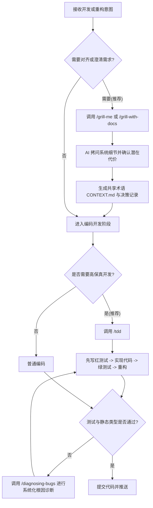

<p align="center">
  <picture>
    <source media="(prefers-color-scheme: dark)" srcset="https://res.cloudinary.com/total-typescript/image/upload/v1777382277/skills-repo-dark_2x.png">
    <source media="(prefers-color-scheme: light)" srcset="https://res.cloudinary.com/total-typescript/image/upload/v1777382277/skill-repo-light_2x.png">
    
  </picture>
</p>

# Matt Pocock's Skills (智能体工程技能集)

本工具箱是由 TypeScript 专家 Matt Pocock 开发并开源的 AI 智能体技能集，旨在用于日常真实项目的工程实践，摆脱缺乏逻辑反馈的盲目“感觉编码”（Vibe Coding）。

这些技能被设计为微型、易修改且支持高度可组合性，旨在通过引入明确的拷问与测试机制，解决 AI 代理编写代码时的意图偏离、过于冗长以及产生复杂 bug 屎山（Ball of Mud）等核心痛点。

---

## 🛠️ 第一阶段：环境自检与首次初始化引导

在使用此套技能卡前，AI 代理或开发人员必须检查运行环境，并完成交互式初始化设定。

### 1. 运行依赖与自检命令

本技能集主要依托于 Node.js 构建的管理生态。请在终端执行以下命令进行依赖自检：

```powershell
# 确认本地 Node.js 和 npm 环境就绪
node -v; npm -v
```

### 2. 缺失依赖的自愈与安装

如果自检显示环境已满足，可以直接通过 npm / npx 一键将本技能集拷贝到您的 AI 代理配置中：

```powershell
npx skills@latest add mattpocock/skills
```

或者，如果您使用的是 Claude Code，也可以直接将其作为原生插件进行免维护安装：

```bash
claude plugin marketplace add mattpocock/skills
claude plugin install mattpocock-skills@mattpocock
```

### 3. 首次使用凭证与交互式自愈配置

安装完成后，必须在智能体（如 Claude Code 或 Codex）中**运行一次交互式初始化引导命令**：

```text
/setup-matt-pocock-skills
```

运行该命令时，系统将通过交互对话方式引导您进行以下自愈性配置：
1. **需求/问题追踪器类型选择**：指定该项目使用的需求来源（可选 GitHub、Linear 或者是本地的 Markdown 文件）。
2. **分类（Triage）标签**：配置在进行需求分流（使用 `/triage`）时要首选应用的标签。
3. **文档与决策记录路径**：指定此后智能体生成的设计文档、ADR 记录文件等要保存的目标文件夹路径。

---

## 🚀 第二阶段：核心执行工作流

初始化完毕后，您便可以在项目中随时调用这些技能卡，以优化 AI 代理的日常编码习惯。

### 1. 核心流程与功能路由机制

本技能包倡导通过强制性的逻辑“反馈环”来提升代码质量，整体功能路由架构如下：



#### 💡 核心技能指令卡：
*   **`/grill-me`**：在动手做任何非代码写作（如撰写文章、梳理逻辑）前进行对齐拷问，确保 AI 完全理解意图。
*   **`/grill-with-docs`**：在动手写代码前对齐，构建属于该仓库的“共享语言”（Domain-Driven Language，即 `CONTEXT.md` 术语表）和 ADR 架构决策文档。
*   **`/tdd`**：红绿测试驱动开发流程，强制 AI 代理“先编写失败测试，再实现功能，最后进行重构”的坚固开发闭环。
*   **`/diagnosing-bugs`**：当测试或编译报错时使用，用科学诊断流程代替盲目修改，快速定位 bug 并进行修复。
*   **`/setup-matt-pocock-skills`**：用于更新或重置您的首选项凭证。

### 2. 命令使用示例

在具备 skills 集成环境的终端或 Agent 交互窗口中，可以输入以下命令启动相应技能：

* **拷问我的意图（在着手开发新功能前）：**
  ```text
  /grill-with-docs 帮我设计一个支持过期自动删除的本地 Key-Value 缓存系统
  ```

* **使用测试驱动（TDD）实现功能：**
  ```text
  /tdd 为刚刚的 Key-Value 缓存系统编写并实现过期测试
  ```

* **遇到复杂 Bug 需要科学诊断：**
  ```text
  /diagnosing-bugs 系统提示内存泄露，帮我进行诊断
  ```

### 3. 工具卸载方法

如果您希望从系统及个人工具收藏库中移除此技能集，只需执行以下操作：
1. 物理删除个人收藏仓库中的子目录：`tools/skills/`。
2. 若在 Claude Code 客户端中通过插件形式安装，请执行：
   ```bash
   claude plugin uninstall mattpocock-skills@mattpocock
   ```
