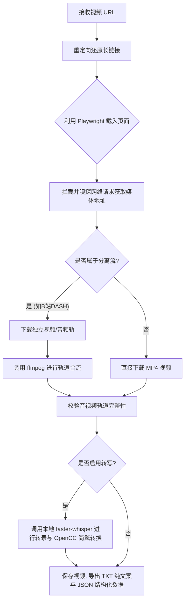

<p align="center">
  
</p>

# Video Batch Download (多平台视频批量下载与本地转写工具)

Video Batch Download 是一个面向公开视频内容的本地化媒体提取和文案转录工具，支持一键下载抖音、B站和小红书的公开视频，并支持在本地离线将音频识别转换为结构化文本，无任何云端 API 依赖。

---

## 🛠️ 第一阶段：环境自检与首次初始化引导

在使用 Video Batch Download 下载或转录视频前，AI 代理或开发人员必须检查运行环境，并进行必要的自愈安装。

### 1. 运行依赖与自检命令

本工具包含 Node.js 端媒体抓取和 Python 本地 Whisper 语音识别。请在终端执行以下指令检查运行依赖的就绪状态：

```powershell
# 1. 验证 Node.js 环境 (需 Node.js 20+)
node -v

# 2. 验证 Python 环境 (需 Python 3.10+)
python --version

# 3. 验证系统中是否已配置 ffmpeg 解码与合流工具
ffmpeg -version
```

### 2. 缺失依赖的自愈与安装

根据运行环境自检的结果，如果有依赖缺失，请按照以下指引进行安装与修复：

* **系统 ffmpeg 缺失**：
  - 无法执行 DASH 分离媒体流合并。请前往 [ffmpeg 官网](https://ffmpeg.org/) 下载最新二进制包，并将其 `bin` 路径添加到系统 PATH 环境变量中。
* **Node.js 依赖及 Playwright 内核自愈**：
  - 在工具根目录下执行以下命令，完成底层模块安装。脚本会自动检测并自动拉取本地 Chromium 无头浏览器内核：
    ```powershell
    npm install
    node scripts/setup.mjs
    ```
* **Python 本地语音转录依赖**：
  - 若需要提取文案，运行以下指令安装转写核心库：
    ```powershell
    pip install -U faster-whisper opencc
    ```
  - *提示*：默认的转录模型较大（首次运行会自动从 Hugging Face 下载约 500 MB 的 Whisper 模型）。如果系统不支持 NVIDIA CUDA 硬件加速，建议显式修改转录启动参数（参考第二阶段）。

### 3. 首次使用凭证与配置自愈

* **完全本地运行**：本工具不读取、不导出、也不使用任何 Cookie 或 Token 凭证。
* **验证码自愈处理**：由于抖音、B站等平台可能会触发防爬虫滑块验证。当遇到下载挂起或请求受阻时，请添加启动参数 **`--headed`** 调出有头浏览器窗口，由开发人员或用户手动在弹出窗口中拖动滑块通过人机验证。

---

## 🚀 第二阶段：核心执行工作流

环境自愈就绪后，即可开启单视频或多视频批量提取和转写流程。

### 1. 核心工作流与平台路由

本工具整体处理媒体下载和转录的逻辑如下：



* **支持平台**：
  - **抖音**：支持公开视频，可实现合流及分离流下载合并，自动拒绝无视频轨的纯音频。
  - **B站 / Bilibili**：支持公开视频，支持 DASH 高画质多音轨视频合并，无 ffmpeg 时自动采用播放流兜底。
  - **小红书**：仅限公开视频笔记，自动应对登录弹窗并嗅探媒体响应。
* **断点续跑**：重复运行时，会自动跳过已成功下载和转写的视频。

### 2. 命令行使用手册

主入口文件为 `scripts/download.mjs`，您可以通过命令行参数灵活微调抓取与转写行为：

```powershell
node scripts/download.mjs "<视频URL>" [参数]
```

#### 常用命令示例：

* **一键下载并转写单个视频（默认模式）：**
  ```powershell
  node scripts/download.mjs "https://www.bilibili.com/video/BVxxxxx"
  ```

* **仅下载视频和元数据（跳过 Whisper 本地语音识别）：**
  ```powershell
  node scripts/download.mjs "https://v.douyin.com/xxxxx" --no-transcribe
  ```

* **批量下载并输出至自定义目录：**
  ```powershell
  node scripts/download.mjs "url1" "url2" "url3" --output "./downloads"
  ```

* **无 NVIDIA CUDA (GPU) 环境下的 CPU 运行配置：**
  ```powershell
  node scripts/download.mjs "https://www.xiaohongshu.com/explore/xxxxx" --device cpu --compute-type int8 --model small
  ```

* **调试并调出浏览器界面（解决滑动人机验证）：**
  ```powershell
  node scripts/download.mjs "https://v.douyin.com/xxxxx" --headed
  ```

#### 📂 提取结果产物：
运行成功后，会在输出目录中生成以下同名产物：
- `*.mp4`：合并轨道后的完整公开视频。
- `*.json`：视频的详细元数据信息（包括发布时间、作者、标题等）。
- `*.txt`：语音转录的文本内容。

### 3. 工具卸载方法

如果您要卸载此工具，请执行：
1. 物理删除个人收藏仓库中的子目录：`tools/video-batch-download/`。
2. （可选）删除 Whisper 本地大模型缓存文件，以释放系统磁盘空间（通常存储在 `%USERPROFILE%\.cache\` 路径下）。
