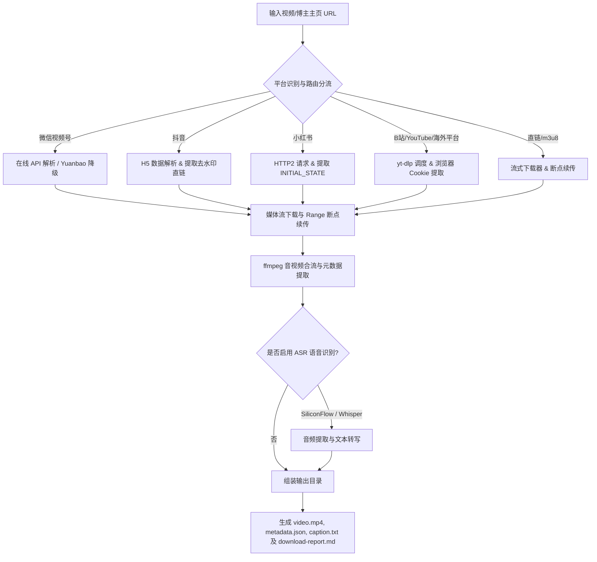

# SHY-downloader (通用多平台视频下载与本地转录工具)

> 🔗 **原项目 GitHub 地址**: [https://github.com/andyshi70/SHY-downloader](https://github.com/andyshi70/SHY-downloader)

SHY-downloader 是一个面向 15+ 主流内容与社交平台的通用视频下载及音视频资产提取 CLI 工具。支持微信视频号（零配置在线解析与本地备选）、抖音（H5 去水印直链）、小红书（HTTP/2 解析）、YouTube、B站、TikTok、X/Twitter、Instagram、Facebook 等平台。工具内置断点续传、字幕提取与封面嵌入、下载历史去重、ASR 语音转文字（SiliconFlow / 本地 Whisper）以及博主主页批量追踪等能力。

---

## 🛠️ 第一阶段：环境自检与首次初始化引导

在使用 SHY-downloader 执行视频下载或批量抓取前，AI Agent 或开发者需执行以下环境与依赖自检。

### 1. 运行环境与依赖自检

请在终端执行以下指令检查运行依赖的就绪状态：

```powershell
# 1. 验证 Python 环境 (需 Python 3.9+)
python --version

# 2. 验证 ffmpeg 编解码工具
ffmpeg -version

# 3. 验证 Python 核心依赖
python -c "import requests, yt_dlp, ffmpeg; print('Core dependencies OK')"
```

### 2. 缺失依赖的自愈与安装

如果自检未通过或缺少依赖，请按照以下指引执行修复：

* **系统 ffmpeg 缺失**：
  - 音视频合并与流转码必需。请前往 [ffmpeg 官网](https://ffmpeg.org/) 下载最新构建版，并将 `bin` 目录加入系统环境变量 PATH。
* **Python 核心依赖安装**：
  ```bash
  pip install requests yt-dlp ffmpeg-python
  ```
* **可选与高级依赖安装**：
  ```bash
  # 小红书 HTTP/2 协议支持
  pip install httpx[http2]

  # 本地离线 Whisper ASR 语音识别
  pip install openai-whisper
  ```

### 3. 渠道配置与本地凭证初始化

SHY-downloader 遵循“能零配置则零配置，必须凭证时优雅引导”的原则：

| 平台 / 渠道 | 接入方式 | 凭证与配置要求 |
| :--- | :--- | :--- |
| **微信视频号 (首选)** | 在线解析 API (`sph.litao.workers.dev`) | ❌ **零配置**，直接输入视频号分享链接即可 |
| **微信视频号 (备选 - Yuanbao API)** | Tencent Yuanbao 接口 | 需配置环境变量 `WECHAT_YUANBAO_COOKIE` |
| **微信视频号 (备选 - 本地代理)** | Go Binary 本地代理模式 | 编译运行 `wx_channels_download` 本地代理 |
| **抖音** | H5 ROUTER_DATA 去水印直链 | ❌ **零配置**，支持常规短链与长链 |
| **小红书** | HTTP/2 + `__INITIAL_STATE__` 提取 | ⚠️ 需携带 `xsec_token` 参数的链接 |
| **YouTube** | yt-dlp + Invidious 降级代理 (360p) | ❌ **零配置** |
| **Bilibili (B站)** | yt-dlp + 自动获取 Chrome Cookies | ❌ **零配置**（自动读取本地浏览器凭证） |
| **X / Twitter / TikTok / IG / FB** | yt-dlp + 浏览器 Cookies 提取 | ❌ **零配置**（未登录支持公开视频） |
| **mp4 / webm / m3u8 直链** | requests 流式分片 + yt-dlp | ❌ **零配置** |

#### 微信视频号 Yuanbao 凭证配置（备选方案）
若在线 API 解析不可用，可采用 Yuanbao 备选接口：
1. 浏览器访问 `https://yuanbao.tencent.com` 并使用微信扫码登录。
2. 打开开发者工具（F12）-> Application -> Cookies -> `https://yuanbao.tencent.com`。
3. 复制 Cookie 字符串，并配置环境变量：
   ```bash
   # Windows PowerShell
   $env:WECHAT_YUANBAO_COOKIE="hy_user=xxx; hy_token=xxx; ..."
   # Linux / macOS
   export WECHAT_YUANBAO_COOKIE="hy_user=xxx; hy_token=xxx; ..."
   ```

---

## 🚀 第二阶段：核心执行工作流

### 1. 核心架构与处理流程



### 2. 命令行使用手册

#### 基础单视频下载
```bash
# 1. 基础下载单个视频 (支持 YouTube / 抖音 / 视频号等任意支持的链接)
python scripts/download_video.py "https://www.youtube.com/watch?v=..."

# 2. 微信视频号一键解析下载 (零配置)
python scripts/download_video.py "https://weixin.qq.com/sph/Axv548mzBF"

# 3. 指定输出视频标题
python scripts/download_video.py --title "我的收藏视频" "https://www.bilibili.com/video/BV..."

# 4. 下载并嵌入字幕与高清封面
python scripts/download_video.py --subtitles --embed-thumbnail "https://www.youtube.com/watch?v=..."

# 5. 仅抓取并导出元数据 (不下载视频流)
python scripts/download_video.py --metadata-only "https://v.douyin.com/..."

# 6. 指定自定义输出目录
python scripts/download_video.py "https://..." --out-root ./downloads
```

#### 批量下载与博主追踪
```bash
# 从文本文件批量导入 URL 列表下载
python scripts/download_video.py --url-file "urls.txt"

# 抖音博主主页视频批量下载
python scripts/douyin_batch.py --sec-user-id "<sec_uid>" --out-dir ./downloads/douyin

# B站 UP 主主页视频批量下载
python scripts/bilibili_batch.py --mid "<user_mid>" --out-dir ./downloads/bilibili

# 多平台博主批量自动追踪与增量更新
python scripts/batch_follow.py --config scripts/creators.example.json
```

#### ASR 语音识别与文案转写
```bash
# 对下载完成的视频进行语音转写 (生成 txt / srt 字幕)
python scripts/asr.py --input-video "./downloads/sample/video.mp4" --engine whisper
```

### 3. 输出结构说明

每个下载任务会在输出目录下生成独立的文件夹：

```text
2026-08-25-video-title/
├── video.mp4              # 最终合并的高清视频文件
├── metadata.json          # 结构化元数据（作者、发布时间、标题、点赞数等）
├── post_caption.txt       # 视频原文案/描述文本
└── download-report.md     # 包含文件哈希与下载状态的完整报告
```

### 4. 注意事项与异常处理

1. **链接时效性**：微信视频号与部分 CDN 直链具有时效性，若解析报错请在 App 中重新复制最新分享链接。
2. **反爬与风控**：小红书链接必须带有 `xsec_token` 参数；对于需要登录的高画质 B 站或海外平台视频，建议确保本地 Chrome 浏览器处于登录状态。
3. **断点续传**：未完成的任务会保留 `.part` 临时文件，再次运行相同命令将自动恢复下载进度。